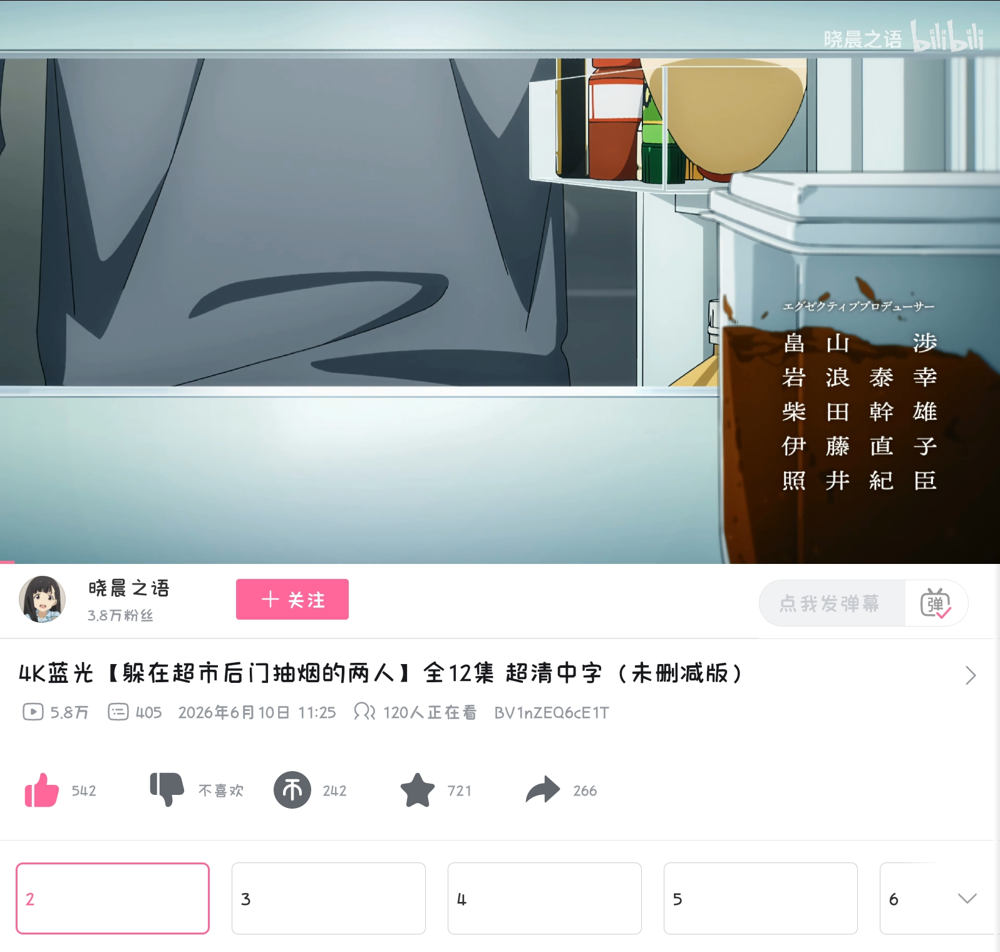
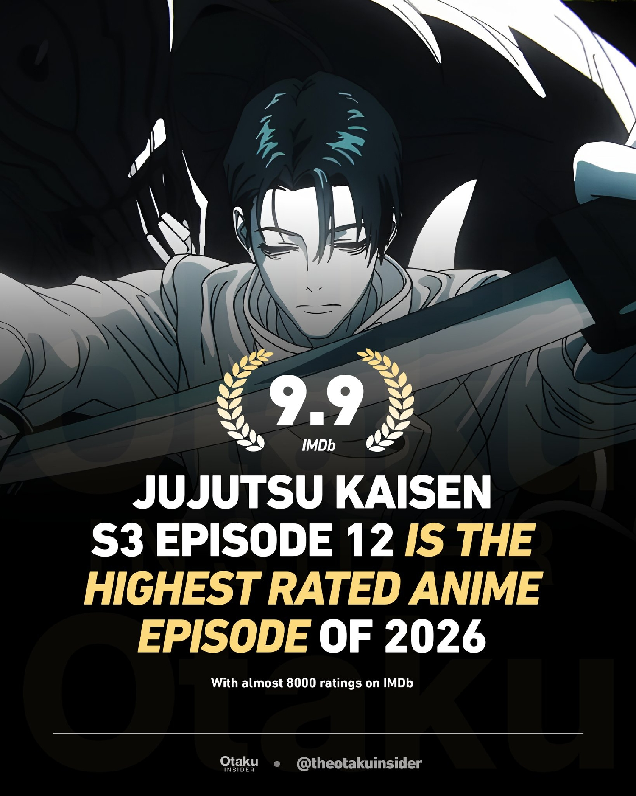
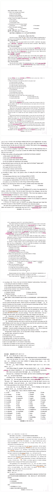

### 追番

 

最近这部番剧（ 《躲在超市后门抽烟的两人》（日语原名：《スーパーの裏でヤニ吸うふたり》 / Super no Ura de Yani Suu Futari ）。）很火，可是对我一个讨厌抽烟的人来说，看着实在反胃。



之前同学都弃坑了，没想到现在《咒术》第三季竟然口碑逆转了？


越来越喜欢 BiliBili 了，不仅看番免费，画质还高清。只要有个大会员，看番无阻。

---


### 捣鼓博客

1. 

我让 Qwen 复刻了一个博客样式：[catarium.me](https://catarium.me/)

🔗 [查看部署效果](https://chat.qwen.ai/s/deploy/t_8a71323b-b801-4a25-be3d-e8024dce3704)

```
<!DOCTYPE html>
<html lang="zh-CN">
<head>
    <meta charset="UTF-8">
    <meta name="viewport" content="width=device-width, initial-scale=1.0">
    <title>Terminal Effect - Fleet Snowfluff</title>
    <style>
        * {
            margin: 0;
            padding: 0;
            box-sizing: border-box;
        }

        body {
            min-height: 100vh;
            display: flex;
            justify-content: center;
            align-items: center;
            /* 这里可以换成你网页的实际背景色，比如白色或浅灰色 */
            background: #ffffff; 
            font-family: 'Courier New', monospace;
        }

        /* 终端容器 - 透明背景胶囊形状 */
        .terminal {
            background: transparent; /* 背景透明 */
            border: 1px solid #e8e8e8; /* 淡淡的边框 */
            border-radius: 50px; /* 大圆角，形成胶囊形状 */
            padding: 12px 30px;
            display: inline-flex;
            align-items: center;
            gap: 15px;
            /* 可选：保留非常轻微的阴影增加立体感 */
            box-shadow: 0 2px 10px rgba(0, 0, 0, 0.03);
        }

        /* 粉色圆点 - 带闪烁动画 */
        .terminal-dot {
            width: 14px;
            height: 14px;
            border-radius: 50%;
            background: #ff8fab; /* 稍微柔和一点的粉色 */
            position: relative;
            animation: pulse 2s ease-in-out infinite;
        }

        /* 脉冲动画 - 粉色圆圈闪烁效果 */
        @keyframes pulse {
            0%, 100% {
                opacity: 1;
                transform: scale(1);
                box-shadow: 0 0 0 0 rgba(255, 143, 171, 0.6);
            }
            50% {
                opacity: 0.8;
                transform: scale(1.05);
                box-shadow: 0 0 0 6px rgba(255, 143, 171, 0);
            }
        }

        /* 波浪号 */
        .terminal-tilde {
            color: #ff8fab;
            font-size: 18px;
            font-weight: 500;
        }

        /* 命令文本 */
        .terminal-command {
            color: #333;
            font-size: 18px;
            font-weight: 500;
            letter-spacing: 0.5px;
        }

        /* 美元符号 */
        .terminal-dollar {
            color: #999;
            font-size: 18px;
            font-weight: 500;
        }
    </style>
</head>
<body>
    <!-- 终端效果 -->
    <div class="terminal">
        <div class="terminal-dot"></div>
        <span class="terminal-tilde">~</span>
        <span class="terminal-command">/ready-to-go</span>
        <span class="terminal-dollar">$</span>
    </div>
</body>
</html>


```

2. 

今天润色了一下博客：


---


### 做一张阎德阴才英语卷

本来是「炎德英才」，我也没想到谐音还能这样用；做了一张**湖南省炎德英才 2026 届高三下学期 5 月联考（L6）英语试题**的试卷，弄成 PDF 就不容易了，为此花了好一段时间。一开始甚至只能在图库编辑器里做，况且没有平板笔，更麻烦了。

没想到 D 篇做漏了，先不管。结果是：语法填空，C 篇全对，B 篇和七选五分别错两个，完形填空错 3 个。一共做了约 35 分钟，已经扣了 13 分，总分差不多也就 120 分了，大失败！




> 1. **T46**
> “Take climate change for example. Even top scientists find it 46 to solve. And here you are, just trying to remember to 47 your own shopping bags to the supermarket.”

这个 just 就很关键，做的时候无法全力注意这个词。做的时候隐隐担心选 hard 会错，结果最后还是错了。

2. **T37**
稍微有点难
> "Research shows that if you look past someone as if they aren't there, they may feel a small hurt. 37 When you make eye contact and smile, you send a message: 'You exist, fellow human. I see you."
答案：A. The opposite is also true.

3. **T39**
与上文联系紧密。

---

# 📚 英语用法深度解析笔记 (整合版)

## 1. 核心词汇与音标 (Core Vocabulary)

| 单词 | DJ 音标 | 词性 | 释义 | 备注/语境 |
| :--- | :--- | :--- | :--- | :--- |
| **equine** | /ˈekwaɪn, ˈiː-/ | adj. | 马的；像马的 | *equine eyes* (模拟马眼视野的装置) |
| **consequential** | /kɒnsəˈkwenʃəl/ | adj. | 重要的 (= significant) | 正式用语，通常置于名词前 |
| **laughably** | /ˈlɑːfəbli/ | adv. | 可笑地；荒谬地 | *laughably obvious* (显而易见到荒谬的程度) |
| **empathy** | /ˈempəθi/ | n. | 同理心；共情 | 文章核心主题 |
| **perspective** | /pəˈspektɪv/ | n. | 视角；观点 | *from the perspective of...* |
| **condense** | /kənˈdens/ | v. | 凝结；浓缩 | 水蒸气遇冷变水滴的核心物理过程 |
| **solar still** | /səʊlə ˈstl/ | n. | 太阳能蒸馏器 | *still* 在此指“蒸馏器”而非“仍然” |
| **invisible** | /ɪnˈvɪzəbl/ | adj. | 看不见的 | 文化虽无形，但可通过触摸感知 |

---

## 2. 高频短语与搭配 (Key Phrases & Collocations)

### 🛠️ DIY Solar Still (太阳能蒸馏器)

| 短语 | 含义 | 语境/功能解析 |
| :--- | :--- | :--- |
| **make special devices** | 制造特殊装置 | **Make** 即“制作”，无需过度解读 *devices*。 |
| **with the base** | 带有底座 | 介词短语作后置定语，修饰 *bottom part*。 |
| **upside down** | /ʌpsaɪd ˈdaʊn/ 倒置地 | *Put the top part upside down* (上半部分倒扣)。 |
| **seal the setup** | 密封装置 | *Seal* (v.) 密封；*Setup* (n.) 装置 (≠ set up v.)。 |
| **fix tightly** | 紧紧固定 | **Fix** = fasten/secure (系紧)，**≠ repair** (修理)。 |
| **no gaps** | 无缝隙 | 防止蒸汽泄漏的关键；常见搭配：*generation gap*, *gap year*。 |
| **bend downward** | 向下弯曲 | *Bend* 作系动词 + *downward* (adv./adj.) 表状态。 |
| **water vapor** | /ˈwɔːtə veɪpə/ 水蒸气 | 受热蒸发的气体形态。 |
| **turn back into** | 变回 | 水蒸气遇冷凝结为液态水滴 (*liquid drops*)。 |
| **roll down at an angle** | 倾斜滚落 | 描述水珠沿石头造成的斜坡移动的物理路径。 |
| **drip into** | 滴入 | 液体最终落入收集容器的动作。 |
| **place value on** | 重视 | = attach importance to。 |
| **go back five generations** | 追溯到五代前 | 描述技艺传承的时间跨度。 |

### 👁️ Perspective & Empathy (视角与共情)

| 短语 | 含义 | 语境/功能解析 |
| :--- | :--- | :--- |
| **look past someone** | 目光掠过；无视 | 视而不见，不理睬。 |
| **fancy device** | 花哨/复杂的设备 | *Fancy* 含“精致但非必要”之意，指代 *equine eyes*。 |
| **bend down** | 俯身；弯腰 | 物理动作象征降低姿态，理解宠物视角。 |
| **assess it from...** | 从…角度评估 | *Assess* = evaluate (正式)；*it* 指代环境(客厅)。 |
| **accommodate us** | 迁就/适应我们 | 动物在日常中不得不适应人类的存在。 |
| **go about daily business** | 忙于日常事务 | **拟人化**表达，将动物比作“上班族”，强调生活规律性。 |
| **differ from... in...** | 在…方面不同 | *in significant ways* (在重要方面)。 |
| **color range** | 色域；色彩范围 | 描述视觉感知的广度。 |
| **free up time** | 腾出时间 | AI处理机械任务，释放时间用于深度思考。 |
| **point out** | 指出 | 指明AI作为工具的具体用途。 |

---

## 3. 句法与修辞逻辑 (Syntax & Rhetoric)

### 💬 "And here you are" 的反差艺术
> **原文：** "And here you are, [doing something simple/trivial]"

-   **功能**：对比性插入语。
-   **效果**：用轻松口语制造 **“宏大议题 vs 微小行动”** 的反差。
-   **目的**：引出面对气候变化时的无力感，为后文“蜜蜂比喻”做铺垫。
-   **结构**：`And (连词) + here (副词) + you are (主系倒装/强调)`

###  破折号 + that 从句的强调作用
-   **结构**：`抽象概念 — that + 具体解释`
-   **修辞效果**：
    1.  **制造悬念**：破折号带来停顿和层次感。
    2.  **同位语解释**：*that* 引导从句具体化前文内容。
    3.  **认知引导**：先概括后具体，由抽象到明确。

### 🗣️ Speak 的介词搭配辨析

| 搭配 | 含义 | 例句 |
| :--- | :--- | :--- |
| **speak about** | 谈论；谈及 (较正式) | She spoke about her creative process. |
| **speak of** | 谈到；提及；值得称道 | Actions speak louder than words. |
| **speak on** | 就…发表演讲/讲话 | He spoke on climate change. |

### 🎭 喜剧创作术语 (Comedy Terms)

| 术语 | 英文 | 功能 |
| :--- | :--- | :--- |
| **铺垫/引子** | Setup /ˈsetʌp/ | 建立情境，引导观众预期。 |
| **笑点/包袱** | Punchline /ˈpʌntʃlaɪn/ | 打破预期，产生幽默效果。 |

> **💡 Craft 的深度解析**
> -   **原句**："focus on crafting punchlines"
> -   **含义**：精心打磨笑点。
> -   **Nuance**：强调用心构思、反复修改的过程，绝非随意编写。
> -   **词性**：动词 (v.) 精心制作 / 名词 (n.) 手艺、工艺。

---

## 4. DIY Solar Still 装置详解 (Device Breakdown)

### 🔩 核心组件功能表

| 组件 | 英文 | 功能说明 | 关键动作/状态 |
| :--- | :--- | :--- | :--- |
| **橡皮筋** | Rubber band | 固定塑料膜，确保密封 | Fix tightly around the edge |
| **小石头** | Small stone | 压弯塑料膜，制造斜坡 | Bends downward; creates a slope |
| **瓶口** | Opening | 倒扣后靠近碗，引导水滴 | Close to but not touching the bowl |
| **缝隙** | Gaps | 必须消除，防止蒸汽泄漏 | Make sure there are no gaps |
| **保鲜膜** | Wrap /ræp/ | 冷凝面，收集水滴 | Plastic wrap (此处 wrap 为名词) |

### ️ 物理原理流程图



### 🔍 易混词辨析：Fix

| 含义 | 例句 | 本文适用? |
| :--- | :--- | :--- |
| **固定/系紧** | Fix the shelf to the wall. | ✅ **Yes** (Fix the wrap) |
| 修理 | Can you fix my bike? | ❌ No |
| 解决 | Fix this problem. | ❌ No |
| 准备(食物) | Fix a sandwich. | ❌ No |
| 确定(日期) | The date is fixed. | ❌ No |

---

## 5. 阅读理解 B 篇：换位思考的层次 (Levels of Empathy)

| 层次 | 方法 | 对象 | 设备需求 | 核心动作 |
| :--- | :--- | :--- | :--- | :--- |
| **Level 1** | Equine eyes | 马 | ✅ Fancy device | 使用特制装置 |
| **Level 2** | Bend down | 狗/猫 | None | 俯身至宠物高度，评估客厅 |
| **Level 3** | Look at residents | 鸟/昆虫 | ❌ None | 想象它们如何迁就人类 |

> **🌟 主题升华**
> 同理心不需要高科技 (*fancy device*)，只需要愿意弯腰低头 (*bend down*)、换个角度看世界的心。当动物们 *go about their daily business* 时，它们一直在 *accommodate* 人类的存在。

---

## 6. Text C & D 补充要点 (AI Writing & Honeybee)

### 🤖 AI in Writing
-   **Brainstorm** /ˈbrenstɔːm/: 头脑风暴，集思广益。
-   **Comedic timing** /kəˈmiːdk ˈtaɪmɪŋ/: 喜剧节奏/时机，指对停顿、语速的精准把控。
-   **Point out**: 指出AI作为工具的具体价值，而非替代人类创意。

###  The Honeybee (完形填空背景)
-   **1/12th of a teaspoon** /ˈtiːspuːn/: 十二分之一茶匙，强调单只蜜蜂贡献之微小。
-   **Contribute** /kənˈtrɪbjuːt/: 贡献，捐献。
-   **Effort** /ˈefət/: 努力，艰难的尝试。

---

## 7. Grammar Fill-in 考点精讲 (Yiran Duan)

| 原题词 | 答案 | DJ 音标 | 考点解析 |
| :--- | :--- | :--- | :--- |
| various | **variety** | /vəraɪəti/ | *the rich variety of...* 需名词，表“多样性”。 |
| handicrafts | **handicrafts** | /ˈhændikrɑːfts/ | 复数形式，手工艺品。 |
| indigo dyeing | **dyeing** | /ˈdaɪɪŋ/ | ️ 保留e，拼写为 *dye-ing* ≠ *dying* (死)。 |
| back | **goes back** | /ɡəʊ bæk/ | *go back to* 追溯到；主语单三用 *goes*。 |
| produce | **producing** | /prəˈduːsɪŋ/ | 现在分词作后置定语，主动关系。 |
| associate | **associated** | /əˈsəʊsieɪtɪd/ | 过去分词作后置定语，被动/完成含义。 |
| Thank | **Thankfully** | /ˈθækfəli/ | 副词修饰整句，位于句首，“值得庆幸的是”。 |
| share | **to share** | /eə(r)/ | 不定式作目的状语或定语，“用来分享文化的媒介”。 |

### ⚠️ 语法填空高频陷阱
-   **Be committed to doing sth.** /biː kəˈmɪtɪd tu ˈduːɪŋ/: 致力于做某事。**To 是介词**，后接动名词 (*demonstrating*)，非不定式。
-   **Set up** /set ʌp/: 动词短语“建立”；**Setup** /ˈsetʌp/: 名词“装置/设置”。注意词性与拼写区别。