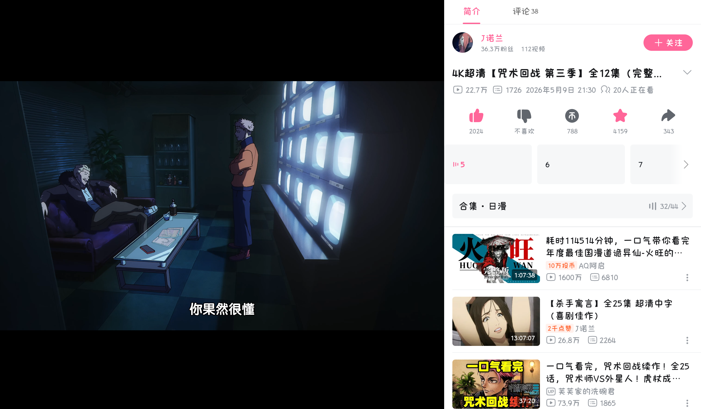
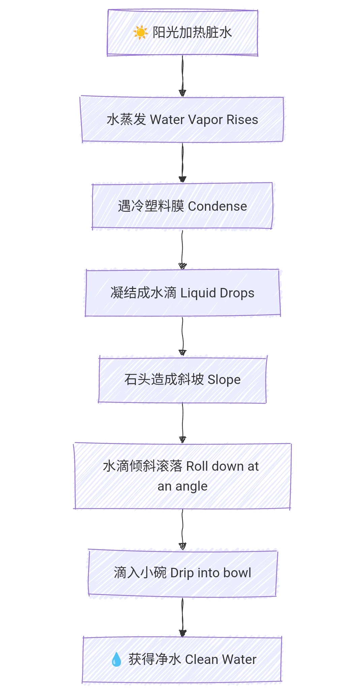

### 追番

 

最近这部番剧（ 《躲在超市后门抽烟的两人》（日语原名：《スーパーの裏でヤニ吸うふたり》 / Super no Ura de Yani Suu Futari ）。）很火，可是对我一个讨厌抽烟的人来说，看着实在反胃。


之前同学都弃坑了，没想到现在《咒术》第三季竟然口碑逆转了？



越来越喜欢 BiliBili 了，不仅看番免费，画质还高清。只要有个大会员，看番无阻。

---


### 捣鼓博客

1. 

我让 Qwen 复刻了一个博客样式：[catarium.me](https://catarium.me/)

🔗 [查看部署效果](https://chat.qwen.ai/s/deploy/t_8a71323b-b801-4a25-be3d-e8024dce3704)

```
<!DOCTYPE html>
<html lang="zh-CN">
<head>
    <meta charset="UTF-8">
    <meta name="viewport" content="width=device-width, initial-scale=1.0">
    <title>Terminal Effect - Fleet Snowfluff</title>
    <style>
        * {
            margin: 0;
            padding: 0;
            box-sizing: border-box;
        }

        body {
            min-height: 100vh;
            display: flex;
            justify-content: center;
            align-items: center;
            /* 这里可以换成你网页的实际背景色，比如白色或浅灰色 */
            background: #ffffff; 
            font-family: 'Courier New', monospace;
        }

        /* 终端容器 - 透明背景胶囊形状 */
        .terminal {
            background: transparent; /* 背景透明 */
            border: 1px solid #e8e8e8; /* 淡淡的边框 */
            border-radius: 50px; /* 大圆角，形成胶囊形状 */
            padding: 12px 30px;
            display: inline-flex;
            align-items: center;
            gap: 15px;
            /* 可选：保留非常轻微的阴影增加立体感 */
            box-shadow: 0 2px 10px rgba(0, 0, 0, 0.03);
        }

        /* 粉色圆点 - 带闪烁动画 */
        .terminal-dot {
            width: 14px;
            height: 14px;
            border-radius: 50%;
            background: #ff8fab; /* 稍微柔和一点的粉色 */
            position: relative;
            animation: pulse 2s ease-in-out infinite;
        }

        /* 脉冲动画 - 粉色圆圈闪烁效果 */
        @keyframes pulse {
            0%, 100% {
                opacity: 1;
                transform: scale(1);
                box-shadow: 0 0 0 0 rgba(255, 143, 171, 0.6);
            }
            50% {
                opacity: 0.8;
                transform: scale(1.05);
                box-shadow: 0 0 0 6px rgba(255, 143, 171, 0);
            }
        }

        /* 波浪号 */
        .terminal-tilde {
            color: #ff8fab;
            font-size: 18px;
            font-weight: 500;
        }

        /* 命令文本 */
        .terminal-command {
            color: #333;
            font-size: 18px;
            font-weight: 500;
            letter-spacing: 0.5px;
        }

        /* 美元符号 */
        .terminal-dollar {
            color: #999;
            font-size: 18px;
            font-weight: 500;
        }
    </style>
</head>
<body>
    <!-- 终端效果 -->
    <div class="terminal">
        <div class="terminal-dot"></div>
        <span class="terminal-tilde">~</span>
        <span class="terminal-command">/ready-to-go</span>
        <span class="terminal-dollar">$</span>
    </div>
</body>
</html>


```

2. 

今天润色了一下博客：


---


### 做一张阎德阴才英语卷

本来是「炎德英才」，我也没想到谐音还能这样用；做了一张**湖南省炎德英才 2026 届高三下学期 5 月联考（L6）英语试题**的试卷，弄成 PDF 就不容易了，为此花了好一段时间。一开始甚至只能在图库编辑器里做，况且没有平板笔，更麻烦了。

没想到 D 篇做漏了，先不管。结果是：语法填空，C 篇全对，B 篇和七选五分别错两个，完形填空错 3 个。一共做了约 35 分钟，已经扣了 13 分，总分差不多也就 120 分了，大失败！


> 1. **T46**
> “Take climate change for example. Even top scientists find it 46 to solve. And here you are, just trying to remember to 47 your own shopping bags to the supermarket.”

这个 just 就很关键，做的时候无法全力注意这个词。做的时候隐隐担心选 hard 会错，结果最后还是错了。

2. **T37**
稍微有点难
> "Research shows that if you look past someone as if they aren't there, they may feel a small hurt. 37 When you make eye contact and smile, you send a message: 'You exist, fellow human. I see you."
答案：A. The opposite is also true.

3. **T39**
与上文联系紧密。

---

# 📚 英语用法笔记

---

## 1. 核心词汇与音标 (Core Vocabulary)

| 单词 | DJ 音标 | 词性 | 释义 | 备注/语境 |
| :--- | :--- | :---: | :--- | :--- |
| **equine** | `/ˈekwaɪn/` | adj. | 马的；像马的 | `equine eyes` 模拟马眼视野装置；`/ˈiːkwaɪn/` 为次要变体 |
| **consequential** | `/ˌkɒnsɪˈkwenʃl/` | adj. | 重要的；有重大意义的 | 正式用语，常置于名词前 |
| **laughably** | `/ˈlɑːfəbli/` | adv. | 可笑地；荒谬地 | `laughably obvious` 显而易见到离谱 |
| **empathy** | `/ˈempəθi/` | n. | 同理心；共情 | 阅读理解核心主题 |
| **perspective** | `/pəˈspektɪv/` | n. | 视角；观点 | 常用搭配 `from the perspective of...` |
| **condense** | `/kənˈdens/` | v. | 凝结；浓缩 | 水蒸气遇冷成水滴的物理过程 |
| **solar still** | `/ˈsəʊlə stɪl/` | n. | 太阳能蒸馏器 | `still` 此处为“蒸馏器”，非副词“仍然” |
| **invisible** | `/ɪnˈvɪzəbl/` | adj. | 看不见的；无形的 | 文化无形，但可通过体验感知 |
- **brainstorm** `/ˈbreɪnstɔːm/`：头脑风暴，发散思路
- **comedic timing** `/kəˈmiːdɪk ˈtaɪmɪŋ/`：喜剧节奏，控制停顿与表达时机

---

## 2. 高频短语与搭配 (Key Phrases & Collocations)

| 短语 | 音标 | 含义 | 用法解析 |
| :--- | :--- | :--- | :--- |
| **make special devices** | `/meɪk ˈspeʃl dɪˈvaɪsɪz/` | 制作特殊装置 | `make` 表“制作”，用途广泛 |
| **with the base** | `/wɪð ðə beɪs/` | 带有底座 | 介词短语作后置定语，修饰物体下部 |
| **upside down** | `/ˌʌpsaɪd ˈdaʊn/` | 倒置；颠倒 | `Put the top part upside down` 把上半部分倒扣 |
| **seal the setup** | `/siːl ðə ˈsetʌp/` | 密封装置 | `seal` 动词表“密封”；`setup` 名词指组装好的装置 |
| **fix tightly** | `/fɪks ˈtaɪtli/` | 紧紧固定 | `fix` 此处=`fasten`，意为“固定”，非“修理” |
| **no gaps** | `/nəʊ ɡæps/` | 无缝隙 | 防止蒸汽泄漏的关键；常见搭配 `generation gap` |
| **bend downward** | `/bend ˈdaʊnwəd/` | 向下弯曲 | `downward` 副词/形容词，表方向 |
| **water vapor** | `/ˈwɔːtə ˈveɪpə/` | 水蒸气 | 水受热蒸发后的气态形式 |
| **turn back into** | `/tɜːn bæk ˈɪntuː/` | 重新变成 | 描述气态变回液态的变化 |
| **roll down at an angle** | `/rəʊl daʊn æt ən ˈæŋɡl/` | 沿斜面滚落 | 水珠的移动轨迹 |
| **drip into** | `/drɪp ˈɪntuː/` | 滴入 | 液体缓慢滴落进入容器 |
| **place value on** | `/pleɪs ˈvæljuː ɒn/` | 重视；看重 | 同义 `attach importance to` |
| **go back five generations**| `/ɡəʊ bæk faɪv ˌdʒenəˈreɪʃnz/`| 追溯到五代以前 | 描述技艺、历史的起源时间 |
| 短语 | 音标 | 含义 | 用法解析 |
| :--- | :--- | :--- | :--- |
| **look past someone** | `/lʊk pɑːst ˈsʌmwʌn/` | 无视；不予理会 | 目光越过，当作没看见 |
| **fancy device** | `/ˈfænsi dɪˈvaɪs/` | 复杂精巧的设备 | 带“好看但非必需”的隐含意味 |
| **bend down** | `/bend daʊn/` | 俯身；弯腰 | 动作也象征“放下姿态换位思考” |
| **assess it from...** | `/əˈses ɪt frəm/` | 从…角度评估 | `assess` 比 `evaluate` 更侧重“综合判断” |
| **accommodate us** | `/əˈkɒmədeɪt əs/` | 迁就；适应我们 | 文中指动物被迫适应人类的生活空间 |
| **go about daily business** | `/ɡəʊ əˈbaʊt ˈdeɪli ˈbɪznəs/` | 忙于日常活动 | 拟人用法，体现生活的规律性 |
| **differ from... in...** | `/ˈdɪfə frəm ɪn/` | 在…方面与…不同 | 对比事物差异的常用句式 |
| **color range** | `/ˈkʌlə reɪndʒ/` | 色彩范围；色域 | 描述视觉可感知的颜色广度 |
| **free up time** | `/friː ʌp taɪm/` | 腾出时间；空出时间 | 处理完基础事务后获得空余时间 |
| **point out** | `/pɔɪnt aʊt/` | 指出；点明 | 主动说明事实、观点或用途 |

---

## 3. 句法与修辞逻辑 (Syntax & Rhetoric)

### 💬 "And here you are" 的反差表达

> **原句结构**：*And here you are, doing something simple/trivial*

- **功能**：过渡式插入语
- **效果**：用口语化句式制造“宏大主题 vs 微小行动”的反差感
- **结构**：`And + here + 主语 + be动词` 倒装强调，突出当下状态
- **用途**：引出复杂问题面前普通人的真实感受

### ➖ 破折号 + that 从句的强调结构

- **基础格式**：`抽象概念 — that + 具体解释`
- **修辞作用**：
  - ✅ **节奏停顿**：破折号带来思考缓冲
  - ✅ **同位说明**：`that` 从句把笼统概念讲清楚
  - ✅ **逻辑递进**：由概括到细节，降低理解难度

### 🗣️ speak 常用介词搭配

| 搭配 | 音标 | 含义 | 例句 |
| :--- | :--- | :--- | :--- |
| **speak about** | `/spiːk əˈbaʊt/` | 谈论；涉及 | *She spoke about her learning experience.* |
| **speak of** | `/spiːk ɒv/` | 提及；显示出 | *Facts speak louder than words.* |
| **speak on** | `/spiːk ɒn/` | 围绕…发表正式讲话 | *The expert spoke on environmental protection.* |

### 🎭 喜剧创作相关术语

| 术语 | 英文 | 音标 | 含义 |
| :--- | :--- | :--- | :--- |
| **铺垫/引子** | **setup** | `/ˈsetʌp/` | 搭建场景，引导读者/观众预期 |
| **笑点/包袱** | **punchline** | `/ˈpʌntʃlaɪn/` | 打破常规预期，产生幽默效果 |

### 💡 craft 用法解析

- **动词**：`/krɑːft/` 精心制作；构思打磨 → *craft a story* (构思故事)
- **名词**：`/krɑːft/` 技艺；工艺 → *writing craft* (写作技巧)
- **文中**：*crafting punchlines* 指反复打磨笑点，强调用心设计的过程

---

## 4. DIY Solar Still(Device Breakdown)


### 物理原理流程图：



### 🔩 核心组件说明

| 组件 | 英文 | 音标 | 功能 | 关键要求 |
| :--- | :--- | :--- | :--- | :--- |
| **橡皮筋** | **rubber band** | `/ˈrʌbə bænd/` | 固定塑料膜边缘 | 绑紧，防止松动 |
| **小石块** | **small stone** | `/smɔːl stəʊn/` | 压出中间低四周高的斜面 | 放在正中心位置 |
| **收集口** | **opening** | `/ˈəʊpnɪŋ/` | 引导水滴流入容器 | 靠近碗但不接触水面 |
| **密封层** | **plastic wrap** | `/ˈplæstɪk ræp/` | 形成冷凝面 | 无破损、无孔洞 |
| **缝隙** | **gaps** | `/ɡæps/` | —— | 必须完全消除，避免漏气 |

### ⚙️ 工作原理

1. 容器内的水/盐水受热 → 蒸发为**水蒸气**
2. 水蒸气上升接触冷塑料膜 → **condense** (凝结成小水珠)
3. 水珠沿斜面汇聚到最低点 → 持续变大
4. 达到重量后自然滴落 → **drip into** (干净收集碗)

### 🔍 易混词辨析：fix

| 含义 | 音标 | 例句 | 本文适用 |
| :--- | :--- | :--- | :---: |
| **固定；绑牢** | `/fɪks/` | *Fix the wrap tightly.* | ✅ 适用 |
| **修理；维修** | `/fɪks/` | *Can you fix the chair?* | ❌ 不适用 |
| **解决；处理** | `/fɪks/` | *We need to fix the problem.* | ❌ 不适用 |
| **准备（餐食）** | `/fɪks/` | *She fixed breakfast.* | ❌ 不适用 |
| **确定（时间）** | `/fɪks/` | *The exam date is fixed.* | ❌ 不适用 |
