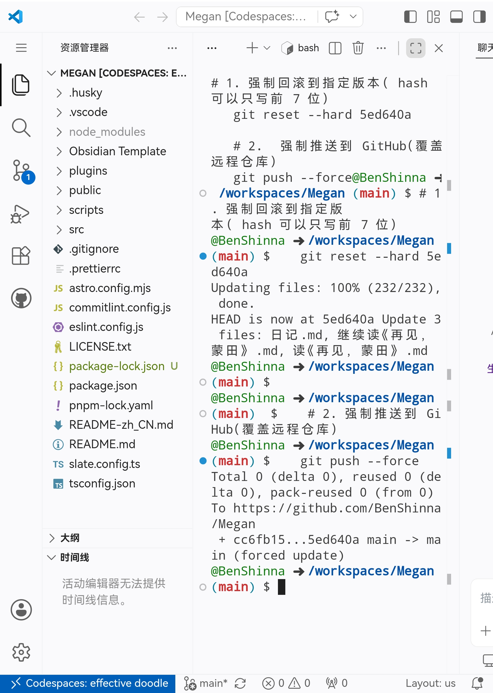

# 日记

今天继续捣鼓博客，不过最终证明还是白忙活一场。甚至不得不在 GiHub 网页的 CodeSpace 里回滚到之前版本。

```
# 1. 强制回滚到指定版本（hash 可以只写前 7 位）
   git reset --hard 5ed640a

   # 2. 强制推送到 GitHub（覆盖远程仓库）
   git push --force   
```




---

# 🛠️ Slate Blog 自定义修改指南

> **项目地址**: [SlateDesign/slate-blog](https://github.com/SlateDesign/slate-blog)
>
> 本文档汇总了对 Slate Blog 主题的所有自定义修改代码。你可以直接复制以下代码块应用到对应文件中。

## 📑 目录
1. [全局字体配置](#1-全局字体配置)
2. [自定义 CSS 样式](#2-自定义-css-样式)
3. [头像组件重构](#3-头像组件重构)
4. [首页布局升级](#4-首页布局升级)
5. [交互脚本注入](#5-交互脚本注入)
6. [新增文章列表页](#6-新增文章列表页)
7. [修改汇总概览](#7-修改汇总概览)

---

## 1. 全局字体配置

**📂 文件**: `src/assets/style/common.css`  
**📝 操作**: 在文件**开头**添加以下代码

```css
/* ==========================================
   全局字体声明 (作用于主页和所有页面)
   ========================================== */
@font-face {
  font-family: 'StarRail';
  src: url('/fonts/StarRailttf.otf') format('opentype');
  font-weight: normal;
  font-style: normal;
  font-display: swap;
}

/* 强制全局所有元素使用星穹铁道字体 */
html, body, body * {
  font-family: 'StarRail', system-ui, -apple-system, sans-serif !important;
}

/* ==========================================
   ↓ 下面是 common.css 原来的代码，请保持不动 ↓
   ========================================== */
```

---

## 2. 自定义 CSS 样式

**📂 文件**: `src/assets/style/blog.css`  
**📝 操作**: 在文件**末尾**追加以下代码

```css
/* ================= 新增自定义样式 ================= */

/* 1. 剧透文本样式 (Spoiler) */
.spoiler {
  filter: blur(5px);
  background-color: rgba(128, 128, 128, 0.2);
  border-radius: 3px;
  transition: filter 0.4s ease, background-color 0.4s ease;
  cursor: pointer;
  padding: 0 2px;
}

@media (hover: hover) {
  .spoiler:not(.revealed):hover {
    filter: blur(0);
    background-color: transparent;
  }
}

.spoiler.revealed {
  filter: blur(0) !important;
  background-color: transparent !important;
}

/* 2. 红色光晕特效 (Red Glow) */
.red-glow {
  display: inline-block;
  padding: 2px 4px;
  box-shadow: 
    0 0 10px 5px rgba(255, 0, 0, 0.8),
    0 0 20px 8px rgba(255, 0, 0, 0.6),
    0 0 30px 12px rgba(255, 0, 0, 0.4);
}

/* 3. 优惠/折扣高亮 (Discount Highlight) */
.highlight-discount {
  display: inline;
  padding: 4px 8px;
  border-radius: 8px;
  background-color: #f8d7da;
  color: #dc3545;
  box-decoration-break: clone;
  -webkit-box-decoration-break: clone;
}

/* 4. Bearblog 风格柔和高亮 (Bear Highlight) */
.highlight-bear {
  display: inline;
  padding: 4px 8px;
  border-radius: 8px;
  background-color: #EDEDEB;
  color: #DE6E7A;
  box-decoration-break: clone;
  -webkit-box-decoration-break: clone;
}

/* 5. 红色粗下划线 (Underline) */
.highlight-underline {
  text-decoration: underline;
  text-decoration-color: #dc3545;
  text-decoration-thickness: 2px;
}

/* 6. 原生 Mark 标签荧光笔效果 */
mark {
  margin: 0 -0.4em;
  padding: 0em 0.4em;
  border-radius: 0.8em 0.3em;
  background: transparent;
  background-image: linear-gradient(
    to right,
    rgba(255, 225, 0, 0.1),
    rgba(255, 225, 0, 0.7) 4%,
    rgba(255, 225, 0, 0.3)
  );
  box-decoration-break: clone;
  -webkit-box-decoration-break: clone;
}
```

---

## 3. 头像组件重构

### 3.1 更新 Header 组件
**📂 文件**: `src/components/layouts/Header.astro`  
**📝 操作**: **完全替换**原有内容

```astro
---
import slateConfig from '~@/slate.config';
import Avatar from '../Avatar/Avatar.astro';

interface Props {
  avatar?: string;
  avatarBack?: string;
}

const {
  avatar = slateConfig.avatar!,
  avatarBack = slateConfig.avatarBack || slateConfig.avatar!
} = Astro.props;
---

<header>
  <div class="mb-9">
    <Avatar
      frontSrc={avatar}
      backSrc={avatarBack}
      alt={slateConfig.title}
      size={56}
    />
  </div>
</header>
```

### 3.2 新建 Avatar 组件
**📂 文件**: `src/components/Avatar/Avatar.astro`  
**📝 操作**: 🆕 **新建文件**

```astro
---
import slateConfig from '~@/slate.config';

interface Props {
  frontSrc?: string;
  backSrc?: string;
  alt?: string;
  size?: number;
}

const {
  frontSrc = slateConfig.avatar!,
  backSrc = slateConfig.avatarBack || slateConfig.avatar!,
  alt = slateConfig.title,
  size = 56,
} = Astro.props;

const sizePx = `${size}px`;
---

<div class="avatar-flip-container" style={`width: ${sizePx}; height: ${sizePx};`}>
  <div class="avatar-flipper">
    <div class="avatar-front">
      
    </div>
    <div class="avatar-back">
      
    </div>
  </div>
</div>

<style>
  .avatar-flip-container {
    perspective: 1000px;
    cursor: pointer;
    flex-shrink: 0;
    display: inline-block;
  }

  .avatar-flipper {
    position: relative;
    width: 100%;
    height: 100%;
    transition: transform 0.6s cubic-bezier(0.4, 0, 0.2, 1);
    transform-style: preserve-3d;
  }

  .avatar-flip-container.flipped .avatar-flipper {
    transform: rotateY(180deg);
  }

  .avatar-front,
  .avatar-back {
    position: absolute;
    inset: 0;
    backface-visibility: hidden;
    border-radius: 50%;
    overflow: hidden;
    box-shadow: 0 2px 12px rgba(0, 0, 0, 0.12);
  }

  .avatar-back {
    transform: rotateY(180deg);
  }

  .avatar-img {
    width: 100%;
    height: 100%;
    object-fit: cover;
    display: block;
    border-radius: 50%;
  }
</style>

<script>
  const containers = document.querySelectorAll('.avatar-flip-container');
  containers.forEach(container => {
    container.addEventListener('click', () => {
      container.classList.toggle('flipped');
    });
  });
</script>
```

---

## 4. 首页布局升级

**📂 文件**: `src/pages/index.astro`  
**📝 操作**: **完全替换**原有内容

```astro
---
import { getCollection } from 'astro:content';
import i18next from '@/i18n';
import Search from '@/components/search';
import PageLayout from '@/components/layouts/PageLayout.astro';
import slateConfig from '~@/slate.config';

const postCollection = await getCollection('post', ({ data }) => {
  return import.meta.env.DEV || data.draft !== true;
});

const tagCounts = postCollection.reduce<Record<string, number>>(
  (res, post) => {
    const postTags = post.data.tags;
    if (!postTags || !postTags.length) return res;
    postTags.forEach((tag) => {
      if (tag.trim() === '') return;
      if (res[tag]) { res[tag]++; } else { res[tag] = 1; }
    });
    return res;
  },
  { [i18next.t('common.all')]: postCollection.length },
);

const tags = Object.keys(tagCounts).map((tag) => ({ name: tag, count: tagCounts[tag] }));

const posts = [...postCollection]
  .sort((a, b) => {
    const dateA = (a.data.pubDate || a.data.published || new Date(0)).getTime();
    const dateB = (b.data.pubDate || b.data.published || new Date(0)).getTime();
    return dateB - dateA;
  })
  .map((post) => ({
    id: post.id,
    slug: post.slug,
    url: `/blog/${post.data.permalink || post.slug}`,
    data: post.data,
    displayDate: post.data.pubDate || post.data.published,
  }));
---

<PageLayout>
  <!-- 顶部区域布局 -->
  <section class="relative mb-8 flex flex-col gap-4 sm:flex-row sm:items-center sm:justify-between sm:mb-10">
    
    <div class="flex flex-col gap-3">
      
      <!-- 🟢 终端胶囊 1：标题 (更大尺寸 + 宽度自适应) -->
      <div class="inline-flex w-fit items-center gap-2.5 rounded-full border border-border/40 bg-muted/20 px-5 py-2 font-mono text-base shadow-sm transition-all hover:shadow-md dark:border-slate-700/80 dark:bg-slate-900/70 sm:text-lg">
        <!-- 粉色脉冲圆点 -->        <span class="relative flex h-3 w-3">
          <span class="absolute inline-flex h-full w-full animate-ping rounded-full bg-pink-400 opacity-75"></span>
          <span class="relative inline-flex h-3 w-3 rounded-full bg-pink-500 shadow-[0_0_8px_rgba(236,72,153,0.6)]"></span>
        </span>
        <span class="text-pink-500 font-bold">~</span>
        <span class="font-medium text-slate-800 dark:text-slate-200">{slateConfig.title}</span>
        <span class="text-slate-400 dark:text-slate-500">$</span>
      </div>

      <!-- 🔵 终端胶囊 2：描述 (更大尺寸 + 宽度自适应) -->
      <div class="inline-flex w-fit items-center gap-2.5 rounded-full border border-border/40 bg-muted/20 px-5 py-2 font-mono text-sm shadow-sm transition-all hover:shadow-md dark:border-slate-700/80 dark:bg-slate-900/70 sm:text-base">
        <!-- 蓝色脉冲圆点 -->
        <span class="relative flex h-2.5 w-2.5">
          <span class="absolute inline-flex h-full w-full animate-ping rounded-full bg-blue-400 opacity-75"></span>
          <span class="relative inline-flex h-2.5 w-2.5 rounded-full bg-blue-500 shadow-[0_0_8px_rgba(59,130,246,0.6)]"></span>
        </span>
        <span class="text-blue-500 font-bold">~</span>
        <span class="text-slate-600 dark:text-slate-400">{slateConfig.description}</span>
        <span class="text-slate-400 dark:text-slate-500">$</span>
      </div>

    </div>

    <!-- 搜索框 -->
    <div class="w-full sm:w-auto sm:min-w-[240px]">
      <Search client:only="react" className="w-full sm:w-auto" />
    </div>

  </section>

  <!-- 文章列表 -->
  <section class="mb-16">
    <div class="text-base text-slate12">
      {posts.map((item) => (
        <a class="flex cursor-pointer flex-col justify-between rounded-lg py-2.5 transition-all active:scale-[0.995] active:bg-slate4 sm:flex-row sm:items-center sm:px-2 sm:hover:bg-slate3" href={item.url} title={item.data.title}>
          <span class="shrink-0">{item.data.title}</span>
          <span class="mx-8 hidden h-px w-full grow border-t border-dashed border-slate6 sm:flex" />
          <span class="shrink-0 text-slate8">
            {item.displayDate?.toLocaleDateString('en-US', { year: 'numeric', month: 'short', day: 'numeric' })}
          </span>
        </a>
      ))}
    </div>
  </section>

  <!-- 标签列表 - 已修复点击功能，All 标签跳转到首页 -->
  <section class="mb-16">
    <ul class="flex flex-wrap gap-2 text-base text-slate10">
      {
        tags.map(({ name, count }) => {          const isAllTag = name === i18next.t('common.all');
          
          return (
            <li>
              <a 
                href={isAllTag ? '/' : `/tags/${encodeURIComponent(name.toLowerCase().replace(/\s+/g, '-'))}`}
                class="block cursor-pointer rounded-full bg-slate3 px-4 py-2 text-slate10 transition-all hover:bg-slate4 hover:text-slate11"
              >
                {name}
                <sup class="text-[10px] text-slate8">{count}</sup>
              </a>
            </li>
          );
        })
      }
    </ul>
  </section>
</PageLayout>
```

---

## 5. 交互脚本注入

**📂 文件**: `src/components/layouts/PageLayout.astro`  
**📝 操作**: 在 `</body>` 标签前**追加**以下脚本

```astro
    <!-- 剧透文本点击揭晓交互 -->
    <script is:inline>
      document.addEventListener('DOMContentLoaded', () => {
        const spoilers = document.querySelectorAll('.spoiler');
        spoilers.forEach(spoiler => {
          spoiler.addEventListener('click', function() {
            this.classList.toggle('revealed');
          });
        });
      });
    </script>
```

---

## 6. 修改汇总概览

| 文件路径 | 操作类型 | 主要修改内容 |
| :--- | :---: | :--- |
| `src/assets/style/common.css` | ✏️ 追加 | 全局字体声明 (StarRail) |
| `src/assets/style/blog.css` | ✏️ 追加 | 6 种自定义高亮/特效样式 |
| `src/components/layouts/Header.astro` | 🔄 替换 | 集成新的 Avatar 组件 |
| `src/components/Avatar/Avatar.astro` | 🆕 新建 | 3D 翻转头像组件 |
| `src/pages/index.astro` | 🔄 替换 | 终端胶囊风格首页布局 |
| `src/components/layouts/PageLayout.astro` | ✏️ 追加 | Spoiler 点击交互脚本 |
