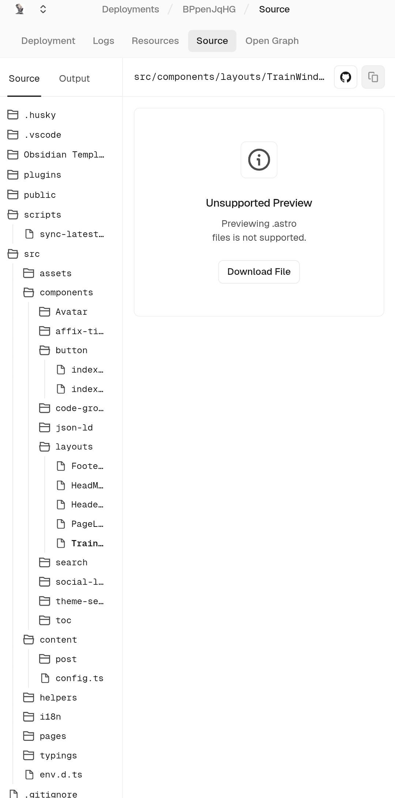
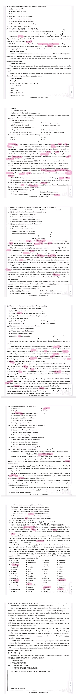

## 复刻「开往」列车动画

模仿 [开往跳转界面的列车动画](https://github.com/travellings-link/travellings/blob/master/public/train.html)，找 AI 复刻了一张高仿图。


### 修改代码

修改文件：`src/components/layouts/Header.astro`

```astro
---
import slateConfig from '~@/slate.config';
import Avatar from '../Avatar/Avatar.astro';

interface Props {
  avatar?: string;
  avatarBack?: string;
}

const {
  avatar = slateConfig.avatar!,
  avatarBack = slateConfig.avatarBack || slateConfig.avatar!
} = Astro.props;
---

<header class="header-container mb-9">
  <div class="avatar-wrapper">
    <Avatar
      frontSrc={avatar}
      backSrc={avatarBack}
      alt={slateConfig.title}
      size={56}
    />
  </div>

  <div class="animation-container">    <div id="window">
      <div id="dennchuu">
        <svg version="1.1" xmlns="http://www.w3.org/2000/svg" viewBox="0 0 500 500">
          <g stroke="#18192B" stroke-width="4" fill="none" stroke-linecap="round" opacity="0.85">
            <path d="M -200 180 L 700 210" />
            <path d="M -200 240 L 700 260" />
          </g>
          
          <g stroke="#18192B" stroke-width="8" fill="none" stroke-linecap="round" stroke-linejoin="round">
            <path d="M 250 100 L 250 500" stroke-width="12" />
            <path d="M 130 150 L 370 150" stroke-width="7" />
            <path d="M 110 140 L 110 160" stroke-width="4" />
            <path d="M 390 140 L 390 160" stroke-width="4" />
            
            <path d="M 160 220 L 340 220" stroke-width="7" />
            
            <path d="M 200 220 L 250 150" stroke-width="5" />
            <path d="M 300 220 L 250 150" stroke-width="5" />
            
            <rect x="260" y="240" width="35" height="60" fill="#FDFCFA" stroke-width="5" />
          </g>
        </svg>
      </div>
    </div>
  </div>
</header>

<style>
  /* 整体横向排布 */
  .header-container {
    display: flex;
    align-items: center;
    gap: 20px;
    width: 100%;
  }

  .avatar-wrapper {
    flex-shrink: 0;
  }

  /* 右侧容器约束 */
  .animation-container {
    flex-grow: 1;
    max-width: 420px;
    height: 150px;
    position: relative;
    overflow: hidden;
  }

  /* 动画主体车窗：彻底干掉任何露出的黑色直角尖尖 */  #window {
    background-color: #FDFCFA; /* 顺滑的高级乳白 */
    width: 100%;
    height: 100%;
    position: absolute;
    border-radius: 24px;       /* 圆角 */
    
    /* 极致裁剪黑边与丑尖尖 */
    overflow: hidden !important;
    background-clip: padding-box;
    -webkit-mask-image: -webkit-radial-gradient(white, black); /* 强迫移动端完美遵循圆角裁剪 */
    
    border: 1px solid rgba(0, 0, 0, 0.05);
    box-shadow: 0 4px 20px rgba(0, 0, 0, 0.02);
  }

  /* 动画旋转层：让居中的电线杆在车窗内完美翻滚 */
  #dennchuu {
    position: absolute;
    width: 180%;              /* 适度放大，让线条有进有出，模拟电车沿途风景 */
    height: 180%;
    top: -40%;
    left: -40%;
    display: flex;
    align-items: center;
    justify-content: center;
    
    transform-origin: center center;
    animation: dennchuu-rotate 18s linear infinite; /* 优雅的电车沿途匀速动画 */
  }

  /* 确保 SVG 铺满动画画布 */
  svg {
    width: 100%;
    height: 100%;
    display: block;
  }

  /* 匀速循环旋转 */
  @keyframes dennchuu-rotate {
    0% {
      transform: rotate(0deg);
    }
    100% {
      transform: rotate(360deg);
    }
  }
</style>
```
## 以后该小心保管代码了

结果差点让代码全没了……


狗 Vercel 竟然不能下载源代码，可是他确实又留着源文件。




##  乱线的真正原因

后来仔细看官方原版，结果发现这个 SVG 是**Excalidraw 手绘风格**的。它本身就有「乱线」不过原因好像也不在此。


<details>
<summary><span class="spoiler">乱线就乱线吧，已经捣鼓一天了，眼睛痛。 </span> </summary>


</details>


## 做题



今晚熬夜把昨晚熬夜没做完的重庆卷做完。全部做完花了差不多 36 分钟。扣了 9.5 分，扣太多。

T25 里 `follow` 有纠缠之意，也无怪我扣分了。七选五就明天看了。

---

### 第一篇：Three ancient log boats (A篇)

**1. log boats**
*   **DJ音标**: /lɒɡ bəʊts/
*   **解析**: 复合名词。`log` 意为“原木”，`log boat` 指“独木舟”或“原木船”，即用整根树干挖空制成的船。
*   **语境**: 文章介绍在Flag Fen Archaeology Park展出的三艘3000多年前的古船。

**2. in a quarry in Cambridgeshire**
*   **DJ音标**: /ɪn ə ˈkwɒri ɪn ˌkæmbrɪdʒˈʃɪə/
*   **解析**:
    *   **quarry** /ˈkwɒri/: (n.) 采石场。指露天开采石头、沙子等的地方。
    *   **Cambridgeshire** /ˌkæmbrɪdʒˈʃɪə/: 剑桥郡（英国地名）。
*   **用法**: 介词短语作地点状语，说明船只发现的地点。

**3. in the fenland**
*   **DJ音标**: /n ðə ˈfenlænd/
*   **解析**:
    *   **fenland** /ˈfenlænd/: (n.) 沼泽地，低洼湿地。`fen` 指沼泽。
*   **语境**: 考古学家认为这些船曾在沼泽地区作为河流使用。

**4. at a specialist facility**
*   **DJ音标**: /æt ə ˈspeəlɪst fəˈsɪləti/
*   **解析**:
    *   **specialist** /ˈspeəlɪst/: (adj.) 专业的，专门的。
    *   **facility** /fəˈsɪləti/: (n.) 设施，场所。这里指专门进行文物保护工作的场所。
*   **用法**: `at a facility` 表示在某个设施/机构内。

---

### 第二篇：Clumsiness (B篇)

**1. Clumsiness**
*   **DJ音标**: /ˈklʌmzinəs/
*   **解析**: (n.) 笨拙。来自形容词 `clumsy` /ˈklʌmzi/。
*   **语境**: 文章开头指出笨拙是最令人羞愧的事情之一。

**2. spill orange juice**
*   **DJ音标**: /spɪl ˈɒrɪndʒ dʒuːs/
*   **解析**:
    *   **spill** /spɪl/: (v.) 溢出，洒出。过去式/过去分词为 `spilled` 或 `spilt`。
*   **搭配**: `spill something on/over...` (把……洒在……上)。

**3. struck our knees against a door**
*   **DJ音标**: /strʌk aʊə niːz əˈɡenst ə dɔː/
*   **解析**:
    *   **strike** /straɪk/ (过去式 **struck** /strʌk/): (v.) 撞击，打。
    *   **strike against**: 撞在……上。
*   **语境**: 描述笨拙的行为——膝盖撞到了门上。

**4. went around for a whole day not noticing there was a piece of lettuce stuck in one of our teeth**
*   **DJ音标**: /went əˈraʊnd fɔːr ə həʊl deɪ nɒt ˈnəʊtɪsɪŋ ðeə wɒz ə piːs əv ˈletɪs stʌk ɪn wʌn əv aʊə tiːθ/
*   **解析**:
    *   **lettuce** /ˈletɪs/: (n.) 生菜。
    *   **stuck in** /stʌk ɪn/: (phrase) 卡在……里面。`stick` 的过去分词。
    *   **注意**: 图片中该处文字较为模糊，看似 "quoting"，但根据语境 "piece of lettuce... one of our teeth"（一片生菜……牙齿），应为 **stuck in**（卡在牙齿里）。
*   **用法**: `go around doing sth` 表示一直做某事（这里指带着生菜叶到处走）。`notice` 后接 `that` 从句（省略了that）。

**5. spill drinks and make fools of ourselves**
*   **DJ音标**: /spɪl drɪŋks ənd meɪk fuːlz əv aʊəˈselvz/
*   **解析**:
    *   **make a fool of oneself**: (idiom) 出洋相，做蠢事。
*   **语境**: 我们弄洒饮料，让自己出丑。

**6. humiliating only if we insist that the only way to be acceptable is to show constant competence**
*   **DJ音标**: /hjuːˈmɪlieɪtɪŋ ˈəʊnli ɪf wi ɪnˈsɪst ðæt ðə ˈəʊnli weɪ tuː biː əkˈseptəbl ɪz tuː ʃəʊ ˈkɒnstənt ˈkɒmpɪtəns/
*   **解析**:
    *   **humiliating** /hjuːˈmɪlieɪtɪŋ/: (adj.) 令人羞辱的，丢脸的。
    *   **insist** /ɪnˈsɪst/: (v.) 坚持认为。
    *   **acceptable** /əkˈseptəbl/: (adj.) 可接受的。
    *   **competence** /ˈkɒmpɪtəns/: (n.) 能力，胜任。
*   **长难句分析**: 这是一个条件状语从句。主句是 "(It is) humiliating"，条件是 "only if we insist..."。意思是：只有当我们坚持认为“展现持续的能力是被接受的唯一途径”时，笨拙才是令人羞辱的。（暗示如果我们接受自己不完美，笨拙就不可耻）。

**7. fall off their bikes**
*   **DJ音标**: /fɔːl ɒf ðeə baɪks/
*   **解析**: 从自行车上摔下来。`fall off` 意为“从……跌落”。

**8. absurd as we are**
*   **DJ音标**: /əbˈsɜːd æz wi ɑː/
*   **解析**:
    *   **absurd** /əbˈsɜːd/: (adj.) 荒谬的，可笑的。这里指“像我们一样笨拙/可笑”。
*   **用法**: `as... as...` 结构。`people as absurd as we are` 意为“像我们一样可笑的人”。

**9. spill something down our front**
*   **DJ音标**: /spɪl ˈsʌmθɪŋ daʊn aʊə frʌnt/
*   **解析**: 把东西洒在胸前/衣服前襟。`front` 指身体或衣服的前部。

---

### 第三篇：World, Meet Poutine (C篇)

**1. fries topped with cheese curds and covered with beef gravy**
*   **DJ音标**: /fraɪz tɒpt wɪð tʃiːz kɜːdz ənd ˈkʌvəd wɪð biːf ˈɡreɪvi/
*   **解析**:
    *   **top** /tɒp/: (v.) 在……上加顶料。`be topped with` 意为“上面铺着……”。
    *   **curd** /kɜd/: (n.) 凝乳。`cheese curds` 是奶酪凝乳，Poutine（肉汁奶酪薯条）的关键成分。
    *   **gravy** /ˈɡreɪvi/: (n.) 肉汁。
*   **语境**: 解释什么是 Poutine（薯条+奶酪凝乳+牛肉汁）。

**2. crispy**
*   **DJ音标**: /ˈkrɪspi/
*   **解析**: (adj.) 酥脆的。形容薯条的口感。

**3. slightly squeaky**
*   **DJ音标**: /ˈslaɪtli ˈskwiːki/
*   **解析**:
    *   **squeaky** /ˈskwiːki/: (adj.) 发出吱吱声的。
*   **语境**: 形容新鲜的奶酪凝乳吃起来会有“吱吱”的口感（squeaky cheese curds）。

**4. coat them**
*   **DJ音标**: /kəʊt əm/
*   **解析**:
    *   **coat** /kəʊt/: (v.) 覆盖，涂上。这里指肉汁包裹着薯条。

**5. Quebecois slang for a "mess"**
*   **DJ音标**: /ˌkwebɪˈkwɑː ˈslæŋ fɔːr ə mes/
*   **解析**:
    *   **Quebecois** /ˌkwebɪˈkwɑ/: (adj.) 魁北克的（法语区）。
    *   **slang** /slæŋ/: (n.) 语。
*   **语境**: 单词 "poutine" 可能来源于魁北克俚语，意为“一团糟”（mess），形容这道菜看起来乱糟糟的。

**6. diner**
*   **DJ音标**: /ˈdaɪnə/
*   **解析**: (n.) 小餐馆，路边餐馆（美式用法）。

**7. dozens of variations**
*   **DJ音标**: /ˈdʌzənz əv ˌveəriˈeɪʃənz/
*   **解析**:
    *   **dozen** /ˈdʌzn/: (n.) 十二个。`dozens of` 意为“许多，几十个”。
    *   **variation** /ˌveəriˈeɪn/: (n.) 变体，变化。

---

### 第四篇：Can rice regrow (D篇)

**1. perennial rice**
*   **DJ音标**: /pəˈreniəl raɪs/
*   **解析**:
    *   **perennial** /pəˈreniəl/: (adj.) 多年的，长期的。（植物学）多年生的。
*   **语境**: 中国科学家开发的“多年生稻”，种一次可以收割多年。

**2. stems**
*   **DJ音标**: /stemz/
*   **解析**: (n.) 茎，干。植物收割后从茎和芽（stems）中重新生长。

**3. yields**
*   **DJ音标**: /jiːldz/
*   **解析**: (n.) 产量。`higher yields` 意为更高的产量。

**4. compact forms**
*   **DJ音标**: /ˈkɒmpækt fɔːmz/
*   **解析**:
    *   **compact** /ˈkɒmpækt/: (adj.) 紧凑的，密集的。
*   **语境**: 农民选择产量高、形态紧凑（compact forms）的品种，导致多年生特性丢失。

**5. reset**
*   **DJ音标**: /riːˈset/
*   **解析**: (v.) 重置。
*   **语境**: 基因 EBT1 像“年龄开关”，允许植物在开花后“重置”（reset）回生长阶段，而不是死亡。

**6. ploughing**
*   **DJ音标**: /ˈplaʊɪŋ/
*   **解析**: (n.) 犁地，耕作。

**7. reduce**
*   **DJ音标**: /rɪˈdjuːs/
*   **解析**: (v.) 减少。

**8. erosion**
*   **DJ音标**: /ɪˈrəʊʒn/
*   **解析**: (n.) 侵蚀（水土流失）。`reduce soil erosion` 减少土壤侵蚀。

**9. orchards**
*   **DJ音标**: /ˈɔːtʃədz/
*   **解析**: (n.) 果园。

---

### 第五篇：The Science Behind Essential Oils (七选五)

**1. ongoing scientific research**
*   **DJ音标**: /ˈɒnɡəɪŋ ˌsaɪənˈtɪfɪk rɪˈsɜːtʃ/
*   **解析**:
    *   **ongoing** /ˈnɡəʊɪŋ/: (adj.) 进行中的，持续的。
*   **语境**: 精油的广泛使用背后是传统、化学和持续的科学研究的混合。

**2. safe**
*   **DJ音标**: /seɪf/
*   **解析**: (adj.) 安全的。
*   **语境**: 许多人错误地认为“天然”就等于“安全”。

**3. limbic system**
*   **DJ音标**: /ˈlɪmbɪk ˈsɪstəm/
*   **解析**:
    *   **limbic** /ˈlmbɪk/: (adj.) 边缘系统的（大脑中负责情绪的部分）。
*   **语境**: 气味分子到达边缘系统，影响情绪和记忆。

**4. peppermint**
*   **DJ音标**: /pepəmɪnt/
*   **解析**: (n.) 薄荷。

**5. mild physical support**
*   **DJ音标**: /maɪld ˈfɪzɪkl səˈpɔːt/
*   **解析**:
    *   **mild** /mald/: (adj.) 轻微的，温和的。
*   **语境**: 精油的效果通常是温和的（mild），而不是像长期医疗护理那样的强效支持。

---

### 第六篇：A beloved bookstore (完形填空)

**1. Semicolon**
*   **DJ音标**: /semikəʊlɒn/
*   **解析**: (n.) 分号（;）。这是书店的名字，也象征“句子本可以结束但选择继续”（寓意自杀预防/生命继续）。

**2. hardships** (选项 43A)
*   **DJ音标**: /ˈhɑːdʃɪps/
*   **解析**: (n.) 艰难，困苦。`overcoming great hardships` 克服巨大困难。

**3. infected** (选项 44A)
*   **DJ音标**: /ɪnˈfektɪd/
*   **解析**: (adj.) 被感染的。
*   **注意**: 此处语境是患癌，通常用 `diagnosed with`。`infected with` 通常指传染病。如果选A可能不准确，但在高亮分析中意为“感染”。

**4. collapsed** (选项 45A)
*   **DJ音标**: /kəˈlæpst/
*   **解析**: (v.) 崩溃，倒塌。指书店倒闭或精神崩溃。

**5. editor** (选项 46B)
*   **DJ音标**: /ˈedɪtə/
*   **解析**: (n.) 编辑。

**6. helpful** (选项 47A)
*   **DJ音标**: /ˈhelpfl/
*   **解析**: (adj.) 有帮助的。

**7. challenge** (选项 48A)
*   **DJ音标**: /ˈtʃælɪndʒ/
*   **解析**: (n.) 挑战。`deadly disease was not the only challenge` 绝症不是唯一的挑战。

**8. approved** (选项 49A)
*   **DJ音标**: /əˈpruːvd/
*   **解析**: (v.) 批准，同意。

**9. broke out** (选项 50A)
*   **DJ音标**: /brəʊk aʊt/
*   **解析**: (phrasal verb) 爆发。通常指战争、疾病爆发。这里高亮可能是指选项，但在语境中 `messages poured in` (消息涌入) 更合适。

**10. owed** (选项 51B)
*   **DJ音标**: /əʊd/
*   **解析**: (v.) 欠。`owe... to...`。

**11. demonstration** (选项 52B)
*   **DJ音标**: /ˌdemənˈstreɪʃn/
*   **解析**: (n.) 示威，演示。`fundraising campaign` (筹款活动) 更合适。

**12. tightened** (选项 53A)
*   **DJ音标**: /ˈtaɪtnd/
*   **解析**: (v.) 变紧。

**13. Surprisingly** (选项 54A)
*   **DJ音标**: /səˈpraɪzɪli/
*   **解析**: (adv.) 令人惊讶地。

**14. pay for** (选项 55A)
*   **DJ音标**: /peɪ fɔː/
*   **解析**: (phrasal verb) 支付。`live by` (依靠……生活/遵循) 在语境 "We live by it" (我们遵循这个理念) 中更合适。


