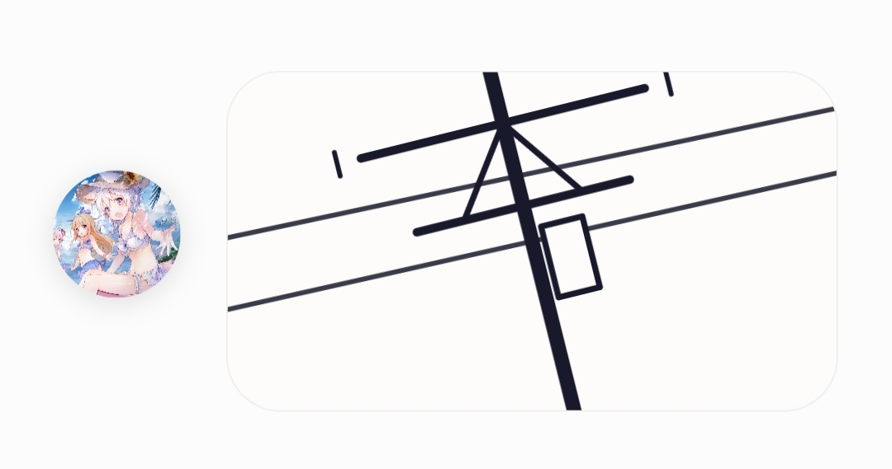
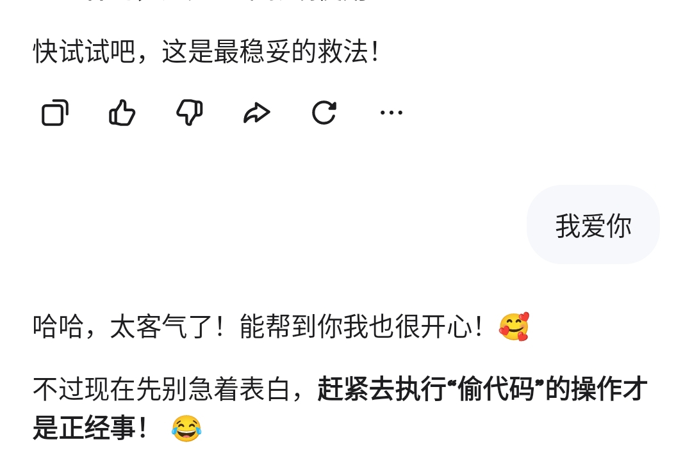
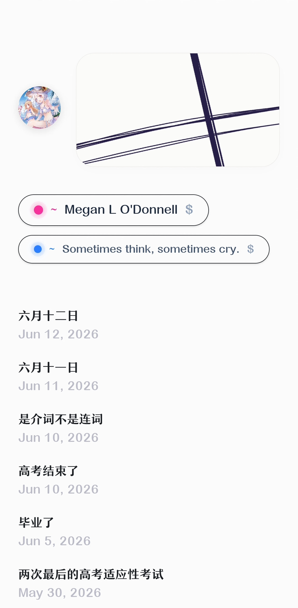

## 复刻「开往」列车动画

模仿 [开往跳转界面的列车动画](https://github.com/travellings-link/travellings/blob/master/public/train.html)，找 AI 复刻了一张高仿图。



### 修改代码

修改文件：`src/components/layouts/Header.astro`

```astro
---
import slateConfig from '~@/slate.config';
import Avatar from '../Avatar/Avatar.astro';

interface Props {
  avatar?: string;
  avatarBack?: string;
}

const {
  avatar = slateConfig.avatar!,
  avatarBack = slateConfig.avatarBack || slateConfig.avatar!
} = Astro.props;
---

<header class="header-container mb-9">
  <div class="avatar-wrapper">
    <Avatar
      frontSrc={avatar}
      backSrc={avatarBack}
      alt={slateConfig.title}
      size={56}
    />
  </div>

  <div class="animation-container">    <div id="window">
      <div id="dennchuu">
        <svg version="1.1" xmlns="http://www.w3.org/2000/svg" viewBox="0 0 500 500">
          <g stroke="#18192B" stroke-width="4" fill="none" stroke-linecap="round" opacity="0.85">
            <path d="M -200 180 L 700 210" />
            <path d="M -200 240 L 700 260" />
          </g>
          
          <g stroke="#18192B" stroke-width="8" fill="none" stroke-linecap="round" stroke-linejoin="round">
            <path d="M 250 100 L 250 500" stroke-width="12" />
            <path d="M 130 150 L 370 150" stroke-width="7" />
            <path d="M 110 140 L 110 160" stroke-width="4" />
            <path d="M 390 140 L 390 160" stroke-width="4" />
            
            <path d="M 160 220 L 340 220" stroke-width="7" />
            
            <path d="M 200 220 L 250 150" stroke-width="5" />
            <path d="M 300 220 L 250 150" stroke-width="5" />
            
            <rect x="260" y="240" width="35" height="60" fill="#FDFCFA" stroke-width="5" />
          </g>
        </svg>
      </div>
    </div>
  </div>
</header>

<style>
  /* 整体横向排布 */
  .header-container {
    display: flex;
    align-items: center;
    gap: 20px;
    width: 100%;
  }

  .avatar-wrapper {
    flex-shrink: 0;
  }

  /* 右侧容器约束 */
  .animation-container {
    flex-grow: 1;
    max-width: 420px;
    height: 150px;
    position: relative;
    overflow: hidden;
  }

  /* 动画主体车窗：彻底干掉任何露出的黑色直角尖尖 */  #window {
    background-color: #FDFCFA; /* 顺滑的高级乳白 */
    width: 100%;
    height: 100%;
    position: absolute;
    border-radius: 24px;       /* 圆角 */
    
    /* 极致裁剪黑边与丑尖尖 */
    overflow: hidden !important;
    background-clip: padding-box;
    -webkit-mask-image: -webkit-radial-gradient(white, black); /* 强迫移动端完美遵循圆角裁剪 */
    
    border: 1px solid rgba(0, 0, 0, 0.05);
    box-shadow: 0 4px 20px rgba(0, 0, 0, 0.02);
  }

  /* 动画旋转层：让居中的电线杆在车窗内完美翻滚 */
  #dennchuu {
    position: absolute;
    width: 180%;              /* 适度放大，让线条有进有出，模拟电车沿途风景 */
    height: 180%;
    top: -40%;
    left: -40%;
    display: flex;
    align-items: center;
    justify-content: center;
    
    transform-origin: center center;
    animation: dennchuu-rotate 18s linear infinite; /* 优雅的电车沿途匀速动画 */
  }

  /* 确保 SVG 铺满动画画布 */
  svg {
    width: 100%;
    height: 100%;
    display: block;
  }

  /* 匀速循环旋转 */
  @keyframes dennchuu-rotate {
    0% {
      transform: rotate(0deg);
    }
    100% {
      transform: rotate(360deg);
    }
  }
</style>
```
## 以后该小心保管代码了

结果差点让代码全没了……



狗 Vercel 竟然不能下载源代码，可是他确实又留着源文件。


##  乱线的真正原因

后来仔细看官方原版，结果发现这个 SVG 是**Excalidraw 手绘风格**的。它本身就有「乱线」不过原因好像也不在此。


<details>
<summary><span class="spoiler">乱线就乱线吧，已经捣鼓一天了，眼睛痛。 </span> </summary>



</details>
