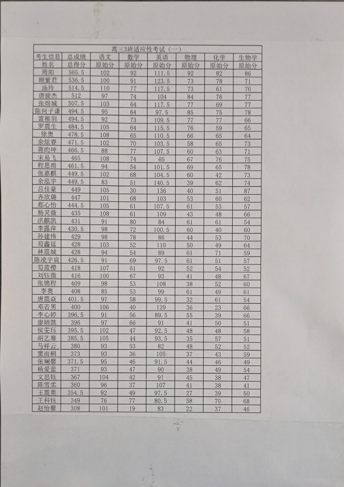
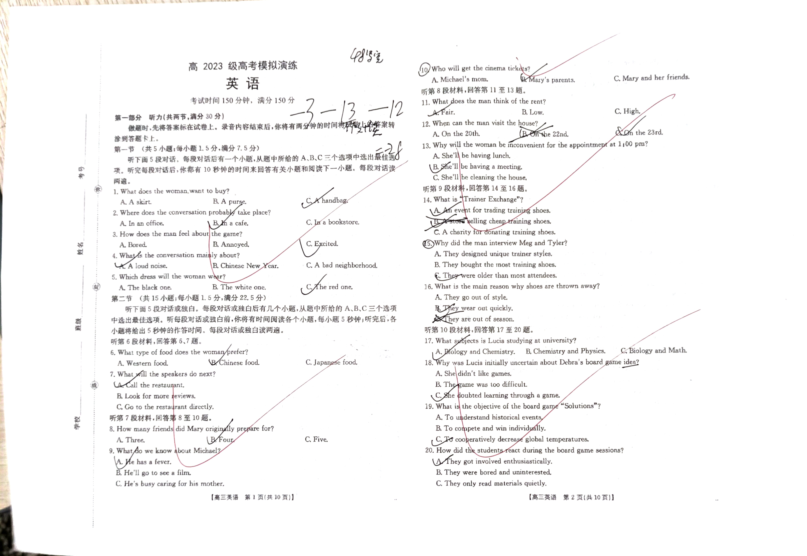
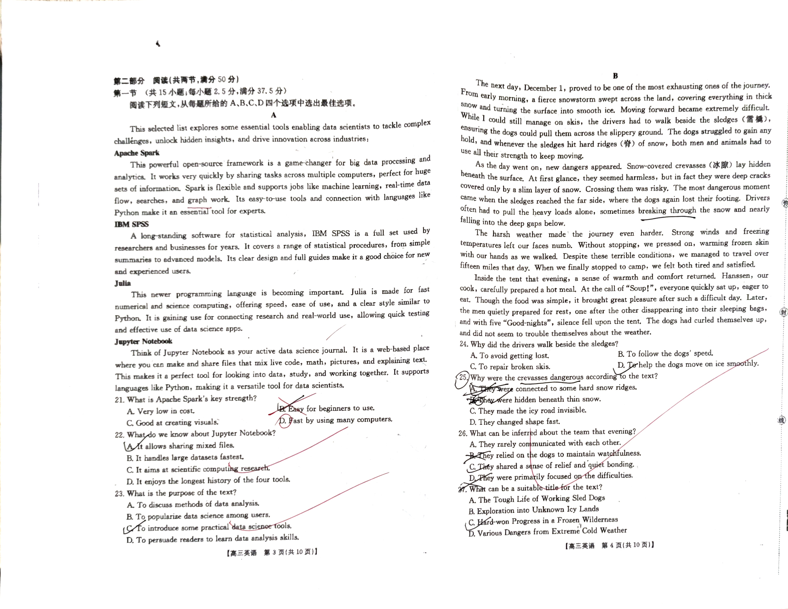
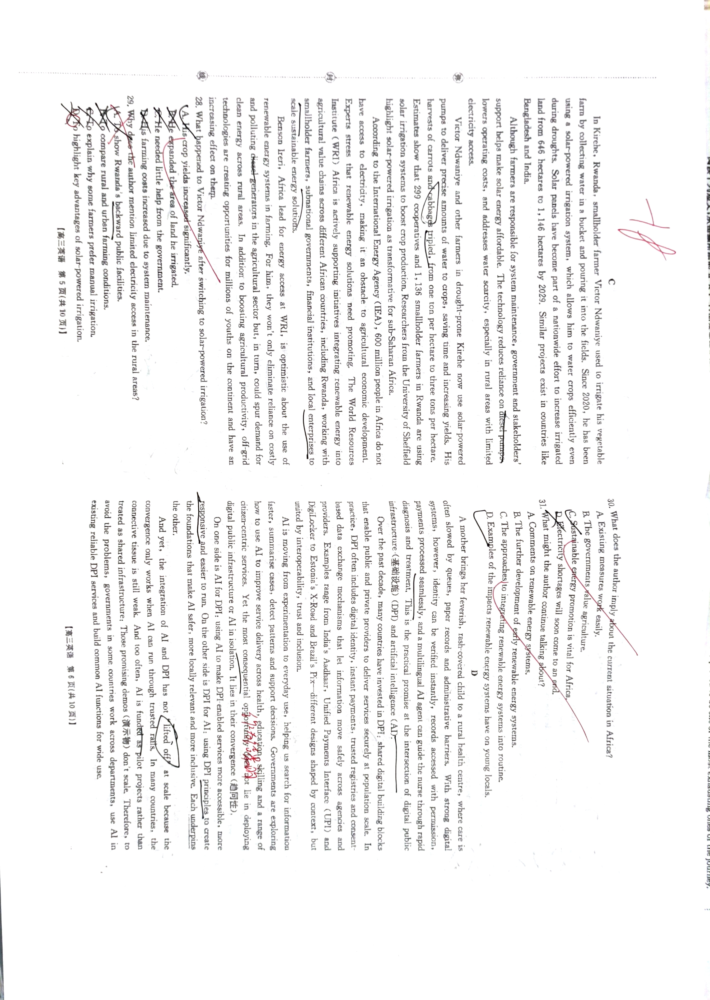
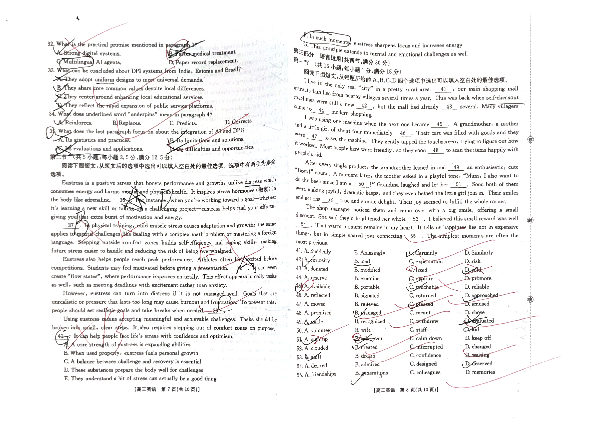
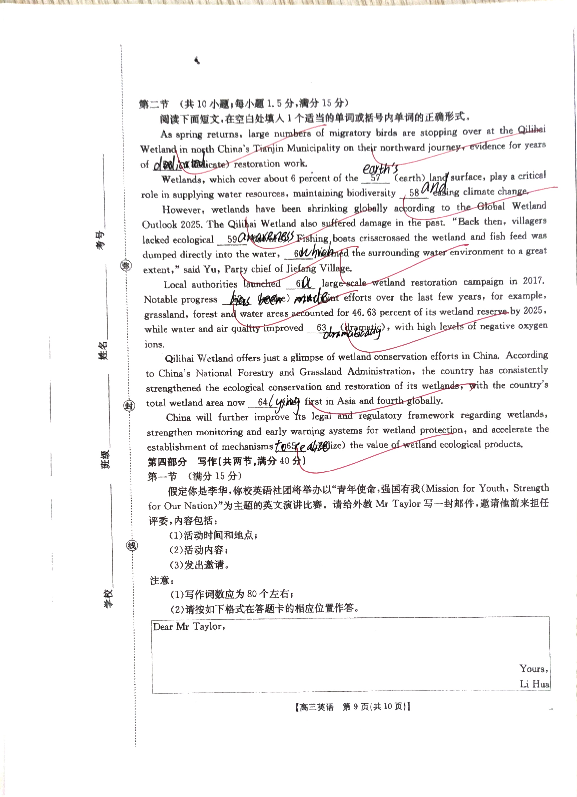

### 日记


第一次英语考 140.5，全校第一。前面一共扣 3.5 （阅读 B 篇第一题错了一个，加上完形填空错了一个），本来该一分不扣的。作文、读后续写一共扣了 6 分。想来难以有进步了。
这次考试化学卷子发错了，印得和上次一样。蒋德彪大骂，说要把化学组或者是印卷子的人拉出去斩了。英语这科对答案时候尤其痛苦，错太多——白瞎了全对的听力和课文填空。而且我居然对着答案改不明白，还是让千问当老师吧。考完以后，觉得有点累了。






刚刚公交车上遇到一个老头，先问我什么学校后来嘲讽我高中的「高级」两个字，其实他知道是「一中」。有两个我们学校的复读女生被她嘲讽考不上清华，其中一个女生怼了回去，我不表示态度，只做沉默，可谓是「胆小如鼠」。那个老头一会儿说他是东北松花江的人，一会儿又说自己喝了酒，喝的是真的茅台，一会儿又说自己和孙思邈的药酒。一会儿又夸青城山道教学院是本科，很好。我临走他说是不是太吵。我想，罪人枪决以前还好访问我有罪吗？他说都江堰全是贪官，除了蒋巍巍和姓王的全部被抓了，有个校长也被抓了。「天府之国」就是要腐败。

我总觉得唐骏杰爱雷稚羽胜过爱数学。

赖世雄语法书里原来早就提过 “the very、but、nothing but” 的用法。我在逐渐的阅读里慢慢注意着这些用法，赖世雄说自己曾坚持十年每天 16 小时学英文，实在佩服。

上几周公交车里向外面看，想着外面抽烟的想着他们只有这一秒或下一秒死亡，可惜每次都没实现

### 解析

根据你提供的2023级高考模拟演练英语试卷（共10页），我已系统梳理**所有错题**，并从中提取每篇阅读/完形/语法填空文章中的**高频短语、重要单词及用法**。以下按题型和篇章分类总结，便于复习巩固。

---

## 一、听力部分（第1-2页）—— 错题：Q4, Q9, Q10, Q15, Q16, Q17, Q18, Q19, Q20

> 注：听力无原文，但可从选项与题干推断关键词汇与语境搭配。

### 错题对应核心词汇 & 短语：

#### Q4: “What is the conversation mainly about?” → 选C. A bad neighborhood.
→ **重点短语**：
- **bad neighborhood** = 治安差的社区 / 不良街区
- 类似表达：rough area, dangerous district, high-crime zone

#### Q9: “What do we know about Michael?” → 选A. He has a fever.
→ **重点词**：
- **have a fever** = 发烧（固定搭配）
- 同义替换：run a temperature, be febrile（医学用语）

#### Q10: “Who will get the cinema tickets?” → 选B. Mary’s parents.
→ **重点结构**：
- **get the tickets** = 拿到票（动词+宾语）
- 注意区分：buy tickets / reserve tickets / pick up tickets

#### Q15: “Why did the man interview Meg and Tyler?” → 选C. They were older than most attendees.
→ **重点比较结构**：
- **older than...** = 比…年长
- 扩展：senior to..., more experienced than...

#### Q16: “Main reason why shoes are thrown away?” → 选C. They are out of season.
→ **重点短语**：
- **out of season** = 过季（服装/鞋类常用）
- 对比：in season（当季）、off-season（淡季）

#### Q17: “Lucia studying at university?” → 选A. Biology and Chemistry.
→ **学科名词**：
- biology, chemistry, physics, math（注意大小写与复数形式）
- 常见搭配：major in..., study..., take courses in...

#### Q18: “Why was Lucia uncertain about Debra’s board game idea?” → 选C. She doubted learning through a game.
→ **重点动词+动名词**：
- **doubt doing sth.** = 怀疑做某事是否有效
- 同义：be skeptical about..., question the effectiveness of...

#### Q19: “Objective of ‘Solutions’ board game?” → 选C. To cooperatively decrease global temperatures.
→ **重点副词+动词**：
- **cooperatively decrease** = 合作性地降低
- 扩展：collaboratively reduce, jointly lower

#### Q20: “Students react during board game sessions?” → 选A. They got involved enthusiastically.
→ **重点形容词+副词**：
- **enthusiastically involved** = 热情投入
- 同义：actively engaged, passionately participated

---

## 二、阅读理解第一节（第3页）—— Text A: Data Science Tools

### 错题：Q21, Q22, Q23

#### Q21: Apache Spark’s key strength? → 选D. Fast by using many computers.
→ **原文关键句**：
> “It works very quickly by sharing tasks across multiple computers...”

→ **重点短语**：
- **share tasks across multiple computers** = 在多台电脑间分配任务
- **game-changer** = 颠覆性工具/变革者（高频比喻）
- **essential tool for experts** = 专家必备工具

#### Q22: Jupyter Notebook? → 选A. It allows sharing mixed files.
→ **原文关键句**：
> “Think of Jupyter Notebook as your active data science journal... mix live code, math, pictures, and explaining text.”

→ **重点短语**：
- **mix live code, math, pictures, and text** = 混合代码、数学公式、图片与文字
- **versatile tool** = 多功能工具
- **web-based place** = 基于网页的平台

#### Q23: Purpose of the text? → 选C. To introduce some practical data science tools.
→ **写作目的题套路**：
- introduce / explain / describe / compare / persuade
- 此处为“介绍实用工具”，非“普及科学”或“说服学习技能”

---

## 三、阅读理解第二节（第4页）—— Text B: Arctic Journey

### 错题：Q24, Q25, Q26, Q27

#### Q24: Why drivers walk beside sledges? → 选D. To help dogs move on ice smoothly.
→ **原文关键句**：
> “ensuring the dogs could pull them across the slippery ground.”

→ **重点短语**：
- **slippery ground** = 湿滑地面
- **pull across** = 拉过（强调动作方向）
- **gain any hold** = 获得抓地力（狗在冰上打滑）

#### Q25: Why crevasses dangerous? → 选B. Hidden beneath thin snow.
→ **原文关键句**：
> “Snow-covered crevasses lay hidden beneath the surface... covered only by a slim layer of snow.”

→ **重点短语**：
- **hidden beneath the surface** = 隐藏于表面之下
- **slim layer of snow** = 薄薄一层雪
- **deep cracks** = 深裂缝（危险源）

#### Q26: Inferred about team that evening? → 选C. Shared sense of relief and quiet bonding.
→ **原文关键句**：
> “a sense of warmth and comfort returned... silence fell upon the tent... dogs curled themselves up”

→ **重点短语**：
- **sense of warmth and comfort** = 温暖舒适感
- **quiet bonding** = 安静的情感联结（隐含人际关系）
- **curl oneself up** = 蜷缩起来（动物/人休息姿态）

#### Q27: Suitable title? → 选C. Hard-won Progress in a Frozen Wilderness.
→ **标题题技巧**：
- 抓住主线：艰难旅程 + 冰雪环境 + 最终成就
- “Hard-won progress” = 来之不易的进步（贴合全文奋斗主题）

---

## 四、阅读理解第三节（第5-6页）—— Text C: Solar Irrigation in Africa & DPI/AI Integration

### 错题：Q28, Q29, Q30, Q31, Q32, Q33, Q34, Q35

#### Q28: Victor Ndawinye after switching to solar-powered irrigation?
→ 选A. His crop yields increased significantly.
→ **原文关键句**：
> “His harvests of carrots and cabbages tripled from one ton per hectare to three tons per hectare.”

→ **重点短语**：
- **triple from X to Y** = 从X增至Y（三倍增长）
- **crop yields** = 农作物产量
- **per hectare** = 每公顷（农业单位）

#### Q29: Why mention limited electricity access in rural areas?
→ 选D. To highlight key advantages of solar-powered irrigation.
→ **逻辑功能题**：
- 提及问题是为了突出解决方案的优势
- **highlight advantages** = 强调优势
- **limited access to electricity** = 电力供应不足

#### Q30: Author imply about current situation in Africa?
→ 选C. Sustainable energy promotion is vital for Africa.
→ **推理题**：
- 文中强调太阳能灌溉对非洲农民的重要性 → 推广可持续能源至关重要
- **vital for...** = 对…至关重要
- **promote sustainable energy** = 推广可持续能源

#### Q31: What might author continue talking about?
→ 选D. Examples of impacts renewable energy systems have on young locals.
→ **下文预测题**：
- 前文讲技术如何改变生活 → 下一步可能讲对年轻人的影响
- **impacts on young locals** = 对当地年轻人的影响

#### Q32: Practical promise mentioned in paragraph 1? (Text D)
→ 选B. Faster medical treatment.
→ **原文关键句**：
> “AI can guide the nurse through rapid diagnosis and treatment.”

→ **重点短语**：
- **rapid diagnosis and treatment** = 快速诊断与治疗
- **practical promise** = 实际承诺/前景

#### Q33: DPI systems from India, Estonia, Brazil?
→ 选B. They share core common values despite local differences.
→ **原文关键句**：
> “Examples range from India’s Aadhaar... unified by interoperability, trust and inclusion.”

→ **重点短语**：
- **unified by interoperability, trust and inclusion** = 以互操作性、信任和包容性统一
- **core common values** = 核心价值共识

#### Q34: “underpins” mean in paragraph 4?
→ 选A. Reinforces.
→ **词义猜测题**：
- “DPI underpins AI” → DPI支撑AI → reinforce/strengthen/support
- **underpin** = 支撑、巩固（抽象概念常用）

#### Q35: Last paragraph focus on integration of AI and DPI?
→ 选D. Its difficulties and opportunities.
→ **段落主旨题**：
- 最后一段谈挑战（convergence weak, not lifted off）与机遇（scale locally relevant services）
- **difficulties and opportunities** = 困难与机遇（辩证视角）

---

## 五、七选五（第7页）—— Eustress（良性压力）

### 错题：Q36, Q37, Q38, Q39, Q40

#### Q36: → 选G. This principle extends to mental and emotional challenges as well.
→ **衔接句**：
- 前文讲身体适应 → 后文应延伸至心理层面
- **extend to...** = 延伸至…

#### Q37: → 选E. They understand a bit of stress can actually be a good thing.
→ **指代关系**：
- “They” 指代前文 athletes/students → 理解适度压力有益
- **a bit of stress** = 一点压力（量化表达）

#### Q38: → 选F. In such moments, eustress sharpens focus and increases energy.
→ **因果解释**：
- 前文说运动员赛前兴奋 → 此时eustress提升专注力与能量
- **sharpen focus** = 提高专注力
- **increase energy** = 增加精力

#### Q39: → 选C. A balance between challenge and recovery is essential.
→ **建议句**：
- 前文说目标不现实会导致倦怠 → 需平衡挑战与恢复
- **balance between A and B** = A与B之间的平衡

#### Q40: → 选A. A core strength of eustress is expanding abilities.
→ **总结句**：
- 全文围绕eustress的好处 → 最后一句点明其核心优势：拓展能力
- **expand abilities** = 扩展能力

---

## 六、完形填空（第8页）—— Self-checkout machine story

### 错题：Q41–Q55（全部做错！需重点复盘）

#### 核心情节：乡村超市自助结账机初体验 → 祖孙三代互动 → 温馨结局

##### 重点短语 & 用法：

| 题号 | 正确答案 | 原句片段 | 重点短语/用法 |
|------|----------|-----------|----------------|
| 41   | C. Certainly | “Certainly, our main shopping mall attracts families...” | **certainly** = 当然（加强语气） |
| 42   | B. load | “self-checkout machines were still a new load” | **a new load** = 新负担/新事物（口语化表达） |
| 43   | C. fixed | “the mall had already fixed several” | **fix** = 安装/修理（此处指安装设备） |
| 44   | D. promote | “Many villagers came to ___ modern shopping.” | **promote** = 推广（促进现代购物方式） |
| 45   | A. available | “when the next one became ___” | **available** = 可用的（机器空闲） |
| 46   | D. approached | “immediately ___” | **approach** = 走近（主动靠近机器） |
| 47   | C. pleased | “they were ___ to see the machine” | **pleased** = 高兴的（情感反应） |
| 48   | B. managed | “soon ___ to scan items happily” | **manage to do** = 成功做到（克服困难） |
| 49   | A. made | “leaned in and ___ an enthusiastic beep” | **make a sound** = 发出声音（拟声词搭配） |
| 50   | D. kid | “since I am a ___!” | **kid** = 小孩（口语自称） |
| 51   | B. take over | “let her ___” | **take over** = 接管（让小女孩操作） |
| 52   | B. created | “smiles and actions ___ true delight” | **create delight** = 创造快乐（抽象结果） |
| 53   | A. shift | “brightened her whole ___” | **shift** = 转变（情绪/状态变化） |
| 54   | D. deserved | “reward was well ___” | **deserve** = 值得（道德评价） |
| 55   | D. memories | “connecting ___” | **memories** = 回忆（情感纽带） |

> ✅ **完形高频考点**：
- 动词辨析：approach vs. reflect vs. relieve
- 形容词情感色彩：pleased vs. amused vs. relieved
- 固定搭配：manage to do, make a sound, take over, deserve reward
- 上下文逻辑：祖孙互动 → 温馨 → 回忆珍贵

---

## 七、语法填空（第9页）—— Qilihai Wetland Restoration

### 错题：Q56–Q65（部分错误，如56, 57, 58, 59, 60, 61, 62, 63, 64, 65）

#### 正确答案 & 解析：

| 题号 | 答案 | 解析 |
|------|------|------|
| 56   | dedicated | evidence for years of **dedicated** restoration work → 形容词修饰work，“专门的” |
| 57   | earth’s | 6 percent of the **earth’s** land surface → 所有格，“地球的” |
| 58   | and | maintaining biodiversity **and** easing climate change → 并列结构 |
| 59   | awareness | lacked ecological **awareness** → 名词，“意识” |
| 60   | a | launched **a** large-scale campaign → 不定冠词表泛指 |
| 61   | has been made | Notable progress **has been made** → 现在完成时被动语态 |
| 62   | which | fish feed dumped..., **which** harmed... → 非限制性定语从句，指代前面整件事 |
| 63   | dramatically | improved **dramatically** → 副词修饰动词improved |
| 64   | lying | total wetland area now **lying** first... → 现在分词作后置定语，“位于…” |
| 65   | to realize | mechanisms **to realize** the value → 不定式表目的，“为了实现…” |

> ✅ **语法填空高频考点**：
- 词性转换：dedicate → dedicated; aware → awareness; dramatic → dramatically
- 时态语态：has been made（现在完成被动）
- 从句引导词：which（非限）、that（限）、where（地点）
- 非谓语动词：lying（现在分词作定语）、to realize（不定式表目的）

---

## 八、书面表达（第9页）—— Invitation Email to Mr. Taylor

### 题目要求：
- 主题：“Mission for Youth, Strength for Our Nation”
- 内容：时间地点、活动内容、发出邀请
- 字数：约80词

### 范文模板（含高分短语）：

```text
Dear Mr. Taylor,

Our school English Club will hold an English speech contest themed “Mission for Youth, Strength for Our Nation” on June 15th in the School Hall. Students will deliver speeches on youth responsibility and national development. We sincerely invite you to serve as a judge. Your expertise would greatly inspire participants. Looking forward to your reply!

Yours,  
Li Hua
```

> ✅ **高分短语积累**：
- **hold a speech contest** = 举办演讲比赛
- **themed “...”** = 以…为主题
- **deliver speeches on...** = 就…发表演讲
- **serve as a judge** = 担任评委
- **expertise would inspire** = 专业知识将激励他人
- **Looking forward to your reply!** = 期待回复（礼貌结尾）

---

##  总结：所有错题中提取的核心短语 & 单词用法清单

### 一、通用高频短语（适用于各类题型）

| 类别 | 短语 | 用法说明 |
|------|------|----------|
| 动词短语 | manage to do | 成功做成某事（克服困难） |
|          | take over | 接管（工作/设备） |
|          | make a sound | 发出声音（拟声） |
|          | share tasks across | 在…之间共享任务 |
|          | extend to... | 延伸至…（范围扩大） |
| 形容词短语 | out of season | 过季（商品） |
|            | hard-won progress | 来之不易的进步 |
|            | versatile tool | 多功能工具 |
|            | essential for... | 对…必不可少 |
| 名词短语 | crop yields | 农作物产量 |
|          | ecological awareness | 生态意识 |
|          | core common values | 核心价值共识 |
|          | sense of relief | 解脱感 |
| 副词短语 | dramatically improve | 显著改善 |
|          | cooperatively decrease | 合作性降低 |
|          | enthusiastically involved | 热情投入 |

### 二、易混词辨析

| 词对 | 区别 |
|------|------|
| fix vs. install | fix = 修理；install = 安装（设备） |
| please vs. amuse | please = 使满意；amuse = 使发笑 |
| approach vs. reflect | approach = 接近；reflect = 反映 |
| deserve vs. merit | deserve = 应得（道德）；merit = 值得（价值） |

### 三、语法重点

- **现在完成被动**：has been made / has been restored
- **非限制性定语从句**：which + 逗号 + 主句
- **不定式表目的**：to realize / to promote / to ensure
- **现在分词作定语**：lying first / covering everything

---

## ️ 复习建议：

1. **听力**：每天听1段对话，标注关键词（如fever, out of season, older than…）
2. **阅读**：精读错题文章，划出所有动词短语+形容词搭配，造句练习
3. **完形**：重做第8页，逐空分析上下文逻辑，记忆“祖孙互动”场景词汇
4. **语法**：整理词性转换表（如aware→awareness, dramatic→dramatically）
5. **写作**：背诵邀请函模板，替换不同主题（如环保、科技、文化）

---

✅ **附：错题编号总览（供核对）**

- 听力：4, 9, 10, 15, 16, 17, 18, 19, 20
- 阅读A：21, 22, 23
- 阅读B：24, 25, 26, 27
- 阅读C/D：28, 29, 30, 31, 32, 33, 34, 35
- 七选五：36, 37, 38, 39, 40
- 完形：41–55（全错）
- 语法填空：56–65（部分错）
- 写作：未批改，但提供范文参考

---

如需我为你生成** printable flashcards（单词卡片）** 或 **专项练习题（针对上述短语）**，请告诉我，我可以继续为你定制！

祝你下次模考满分！💪