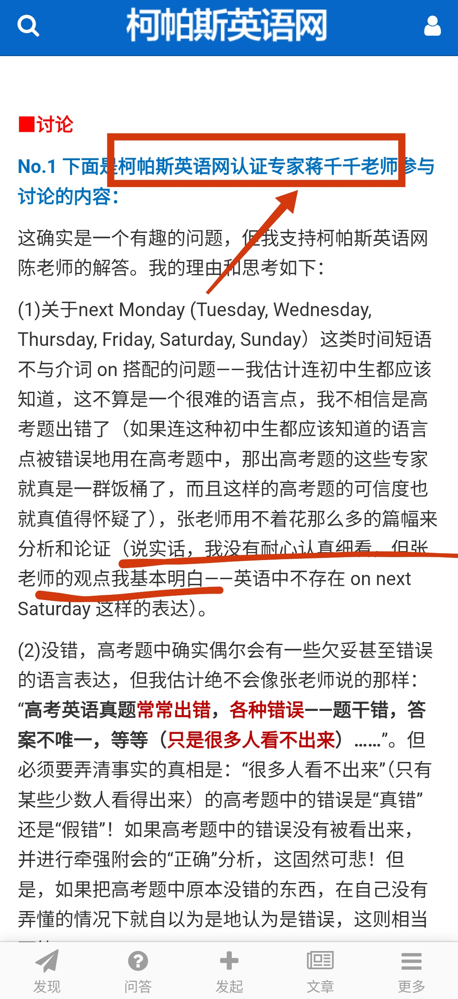
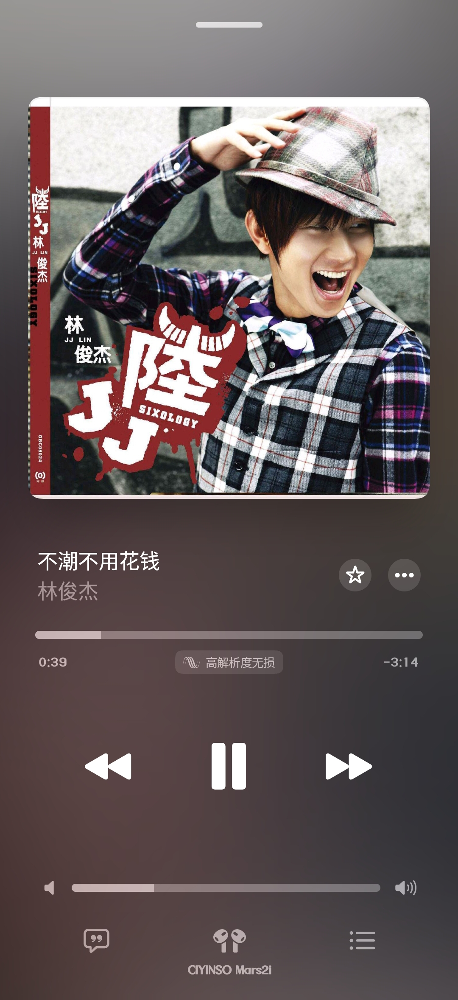
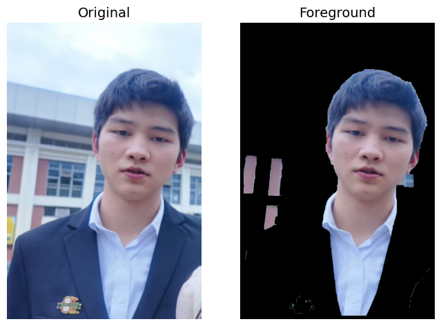

### 今天看见的第一个笑话

这就是所谓“专家”，竟然连看都不用看。

### 日记

1. 

我一度以为这里的“扣扣”会和李玟（Co Co）有关系，好像没有。

上周陈何子谦用它的华为手表放这首歌，让我觉得林俊杰的嗓音的确很特别，且这首歌节奏感又强，比较好听，只是歌词实在太差。

2. Kimi 不是什么好人，生成到这里就停了——尸首悬空。

不过刘钰微用豆包帮我生成了几张，凑合交也不错了。Kimi 我再也不会用了，效果太差，还总是用不了，问英语题用千问就不错。

3. 这样的雨季真是恐怖得出奇，我觉得害怕。