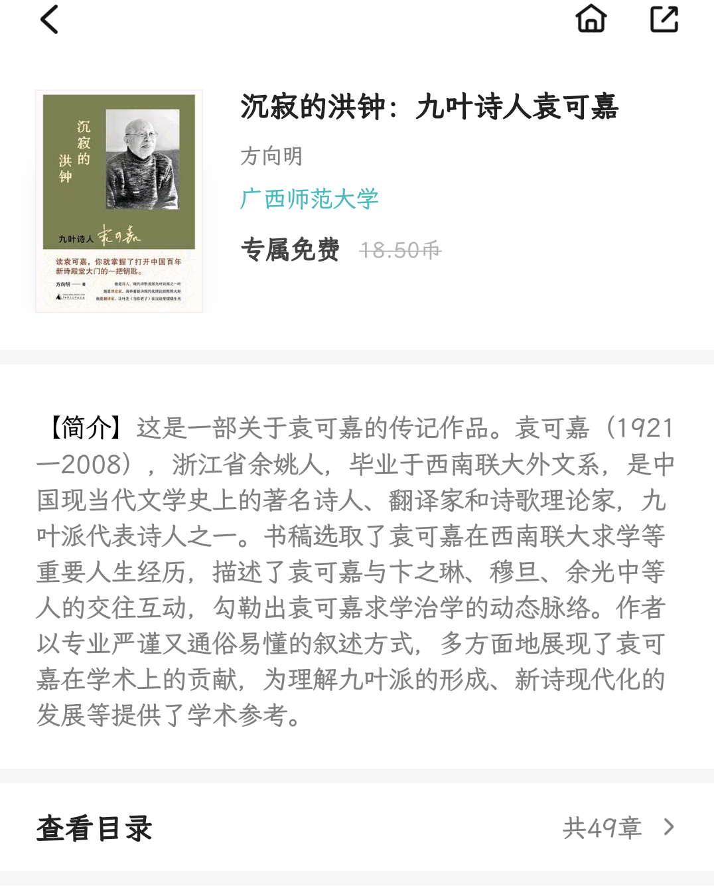
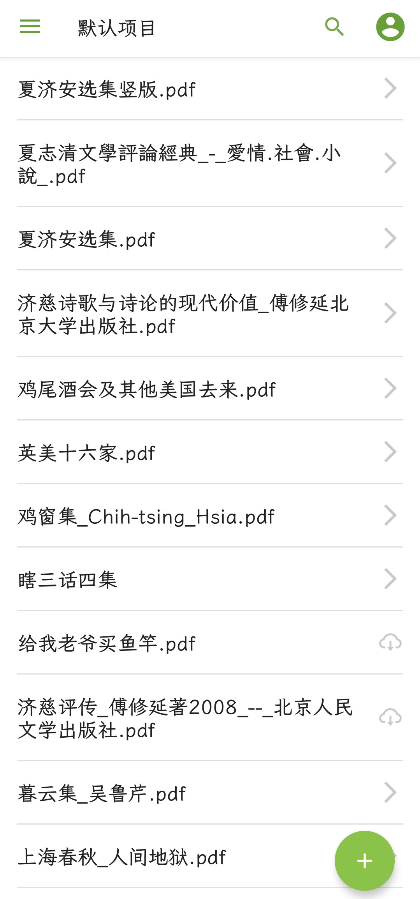

抄一段《瞎三话四集·严冬隔日记》

> 隔日者，乃是隔数日，或者隔十数日，并非隔一日非记上一笔不可，有时实无可记也。

最近总想动手记一点东西，丰富下博客，不过重复搁置下来而已。

随意翻了翻这本书，说是给袁可嘉作的传，竟然连一笔夏济安也没提到。

---

我向来喜欢翻翻有关夏氏兄弟的读书生活的资料，今天居然发现夏济安的著作大概都可以在网上找得到了，连同他那篇《苏麻子的膏药》——从我读他们二人的书信来往就耳熟的一篇文章。我找电子书通常就在 WeLib.org、Anna's Archive 和 Z-Library 三个网站——三家竟然往往互补——里面找，今天一翻，果然找到《黑暗的闸门》，《夏济安选集》等，不过值得一提的是志文出版社那一版的《夏济安选集》才选入了《苏麻子的膏药》。

---

今天也发现了一个叫 IvySci 的 PDF 阅读器，在平板上的阅读体验很不错。可是会员实在太贵，而且没有本地阅读的功能，一定要登录账号上传云端才能看。

从前读夏志清文章的时候就知道有个叫吴鲁芹的人是他的好友。这两天终于读到几篇他的文章，我大概还记得他谈过 Saul Bellow，仿佛他获过诺贝尔奖，而且是越畅销越能写出好作品的奇人。要数印象最深的还是 Walter L. Cronkite Jr.，他与艾森豪威尔将军谈及巴顿将军的逸事；他谈数学很可爱，我没见过几个作文章的人反倒谈自己学数学的不快，反正夏氏兄弟一向以精英面貌出现的。原来在数学门口徘徊的除掉我也是还有其他人的，然而他自己打球的经历我几乎全跳过了。以前不曾见过他这样的写作风格的文章，觉得有点奇怪；他谈“吴下流”办文学杂志也谈的自然，明白，补齐一部分我对夏济安的画像。

---

> *《鸡窗集》*
>> 惟其如此，济安对五四以来的一般名学者、思想家都看不大起，他们虽有通人之名，在他看来，却还不够"通"。他们对于"欧洲的心灵"还没有能真正领悟，偏喜借用一些欧美的观念来解释中国情形，指导中国青年，岂不可笑？下面抄录济安讨论中国俗文学的文字，提到了王国维、胡适之、陈寅恪三位大师，他们三位国学的渊博，是济安万万不可及的，他对他们因之异常佩服。但三位大师之间，心灵上和济安最有默契的是王国维，因为他觉得他真懂得欧洲文化的微妙处，因之对他的文学见解，也特别看重。相反的，胡适之先生所倡导的乐观主义、实验主义、科学精神、文白对立的白话文学都是济安所不能接受的。他虽然对于近代小说家詹姆斯、乔伊斯、福克纳那种艰涩甚至怪拗的文体极为欣赏，他自己在《文学杂志》上所提倡的是"朴素的、清醒的、理智的"文章：文章第一要写得通顺；运用文字忠实地表达自己的 vision，不得不创造较古怪的文体，那是大文学家的企图，而这种努力和五四以来所流行的"美文体"白话文是分道扬镳的。济安痛恨把许多形容词堆积而成"散文诗"式的白话文，他提倡朴素的文体，可说是他对"新文艺腔"白话文的反动。写小说，除文字外，当然要注意到内容和结构，他讨厌故事空洞和现实脱节的小说，对只平铺直叙不会把故事内现存的意象组织成精致的结构的小说家曾发过不少感慨。

夏济安的看法与我同，我们真可谓是“默契非凡”了。废名提倡写实，否则即落入思想不清楚的境地，实在发我深省——我从他文章的片段看来。由之，我决定作文时都构想出一个第三者来，尽管我最想写的是日记，或者所谓的 Essay（我想不到一个好的翻译，就保留英文了） 一类。

> 吴鲁芹 *《英美十六家》自序*
>> 附录的读者投书，并不是因为这两封信对我谬加奖掖，自己往脸上贴金，或者藉此为这本书作宣传。主要是因为我在属笔为文之时，心中希望有两类不同的读者能接受这一系列的报道与评论的文字。第一类是比较熟悉当代英美文学的人，第二类是对当代英美文学近乎是一无所知的人。我希望第一类的读者看了不觉得我是"信口开河"，第二类的读者看了不觉得我是"不知所云"。

就阐尽了作文的一个要求。

