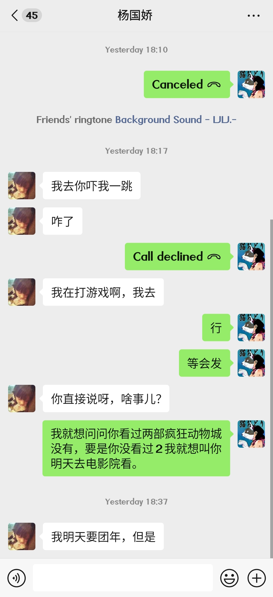
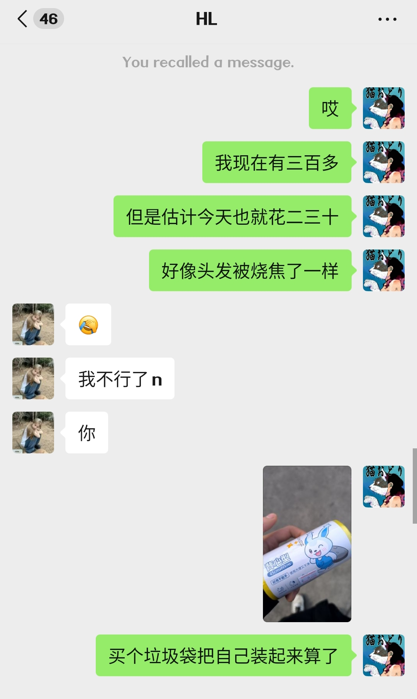
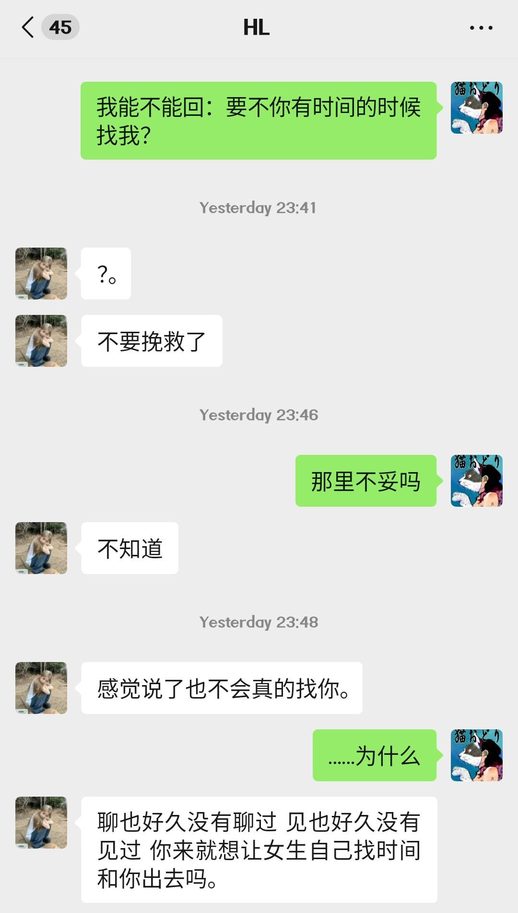
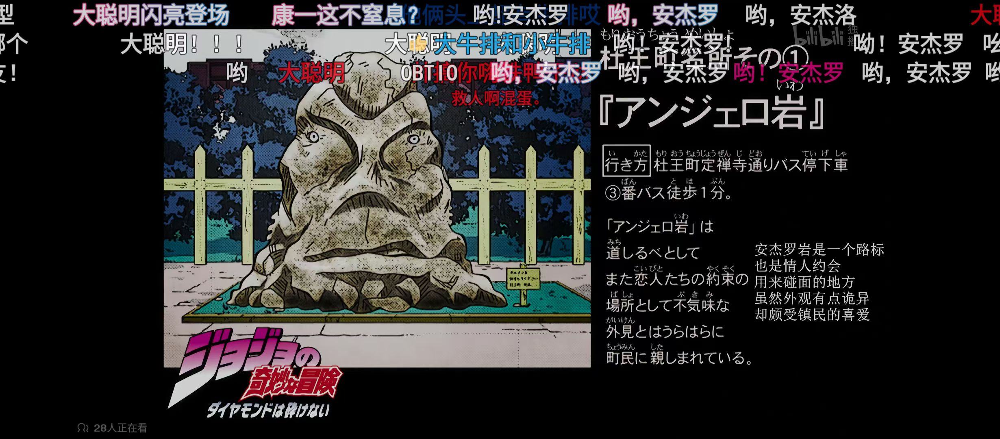

### 二月十五日 归来时、天阴、风大作、倍感凄凉

坐公交车回来的路上看见江泽民题字**创科学治水之先例，建华夏文明之瑰宝**。可惜没有拍下来，当时我觉得后面的人看着我拍照有些许的尴尬。

---

今日支出：

| 内容 | 费用 |
|---|---|
| 火锅粉 | 12 元 |
| 赶公交车（有公交卡） | 顶多 3 元 |
| 一瓶怡宝 | 4 元 |

今天这一场，和流浪有何异？

王鼎钧《昨天的云》一个乞丐故事：他遇到一个乞丐，这个乞丐有着一股不同寻常的傲气。

> 他说，世上有一种人，他做乞丐，正因为他有本事。他说，他的师祖，本来在皇宫里保护皇帝，顺便教导一批太监习武。自然，那是很久很久以前的事了。老皇帝驾崩，他们奉遗命效忠小皇帝，那也是很久很久以前的事了。……
> 他说，小皇帝毕竟太小了，朝中奸臣乱政，叛贼夺权，发生惊天动地的政变。一场大火焚毁了宫殿，幼主下落不明。他的师祖带着那批学武的太监逃出宫外，师祖说，改朝换代是无法挽回的了，但是，咱们谁也不投降。师祖说，既然连当朝皇帝都不配做我们的老板，世上还有谁能做我们的老板？从今以后我们不侍候任何人，不受任何人的管辖，不接受任何人的俸禄，我们不服王法，我们的名字不在户口。 那么，我们做乞丐吧。 
> 我们一面做乞丐，一面舒散亡国之痛吧。 
> 我们一面流浪行乞，一面挨家挨户寻找幼主吧。

看我今日之困顿，反不如一乞丐活得自在。

她只留下「我明天要团年，但是」数字。那么我恐怕已经被拒绝了吧？她没有再留下几个字表示另外的日期，恐怕这已经就是她的婉拒了吧？再回不过使她生气而已；我为了等这几个字，发完消息就断网，把英语作业写完大半才敢重新连接。然而等我的原来只是这个。晚上因为这件事睡不着，大哭一场——眼泪流得没有丝毫尊严。我原本觉得打扰她不对，已经准备好道歉。现在我是没有回复的勇气了。

要是我初中时候能有点零花钱，要是我多找她聊会儿天，要是我多约她出游数次，或许就不一样了？或许，那也不是我了。只有高中才算有点零花钱。「要是要是…」这样的句式排下去，真叫人可笑。

---

昨天读《王佐良随笔：心智文采》，读到王佐良谈彭斯，心智突然就激动起来：
> 以他交游之广，也只谋到了一个税务局职员的位置，而且仍然收入短缺，到死都还不清债——无怪乎他曾慨叹道：
>> 一个富于天才而且确有贡献的人到处受冷遇，而一个无用的庸人却因为有钱来装扮自己到处受欢迎。天下不平之事莫过于此了！一个能干的人，有自尊心，敬仰一切真正值得敬仰的东西，同时又认识到人是生来平等的；他在一位贵人的筵席上遇见了某地主、某爵爷……**他们的才干比不上一个蹩脚的小裁缝，情感浅薄得不值三分钱**，然而他们受到注意和关照，而贫穷的天才则什么也得不着，他的心是如何的愤激呵！

「**他们的才干比不上一个蹩脚的小裁缝，情感浅薄得不值三分钱**」这句话可不就说的我那「遥远的亲戚」？选高中的时候他们好像全要做主，他们或许不坏，然而说起来还不坏就果真不坏了？那时候翻翻《新青年》序言，好像谈的「自由」刚好与他们行事相反？选团员时，雷议叫我去陈权那里去求人办事，我没做，也颇为不屑。曾老师（曾晓红）亦不曾提过什么关系，最后是我和程思羽抽签定夺了，因为筛下来只有我和她合格——由于青年大学习的关系。

他打电话过来也就寒暄几句，无非想教导别人几句，哪里有什么用？哪用得着他来？

---

*JoJo's Bizarre Adventure* 是少数能看下去的番。

---

已经 2026 了啊，以后，我和杨国娇关系又怎样呢？
