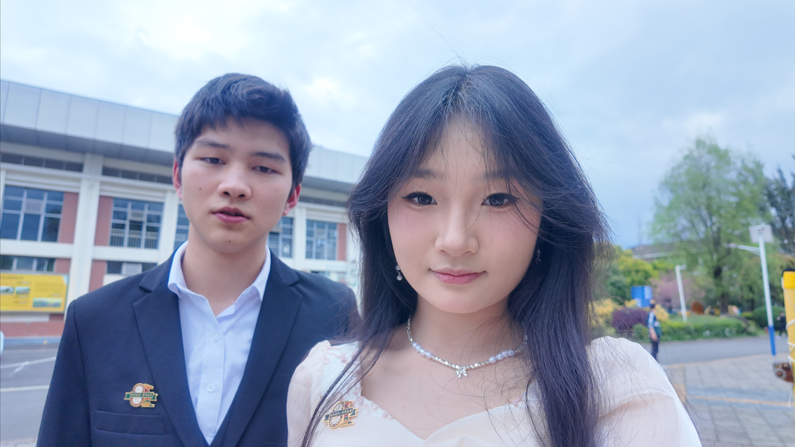
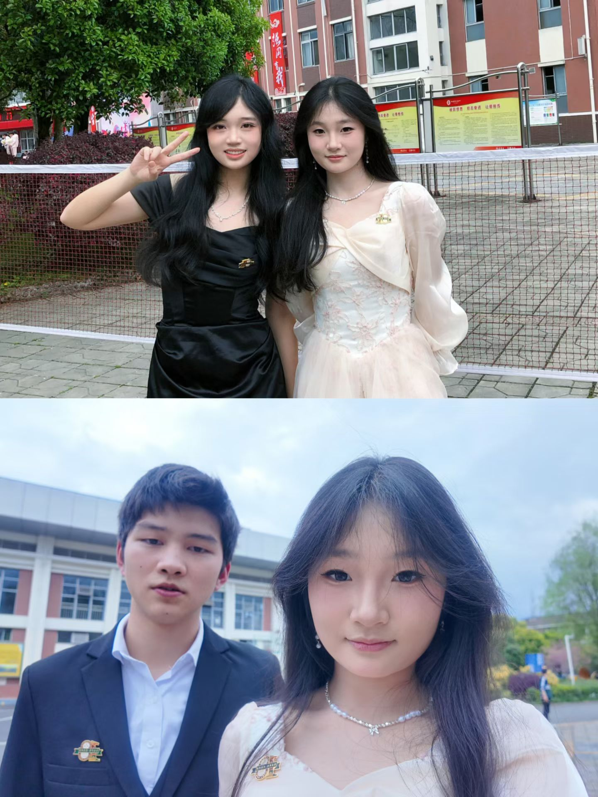
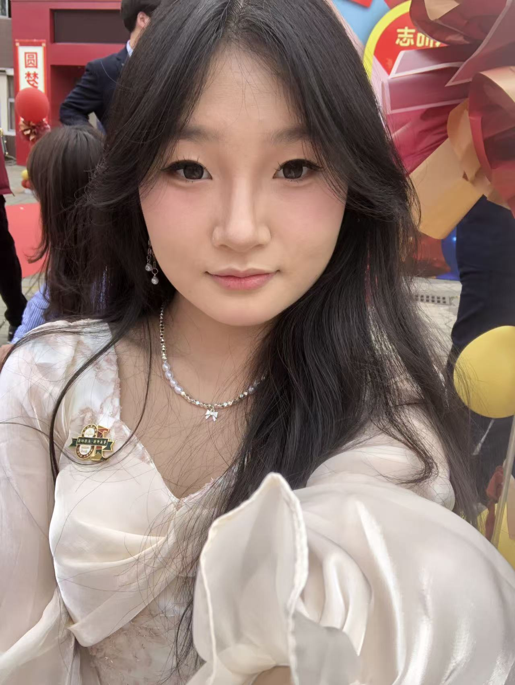
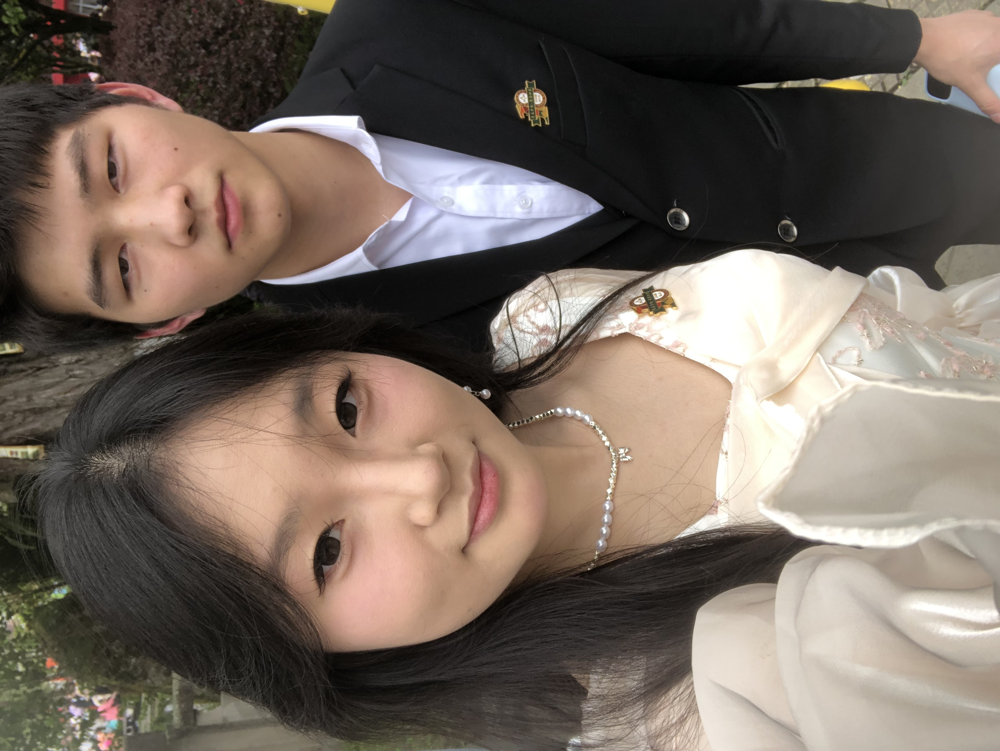
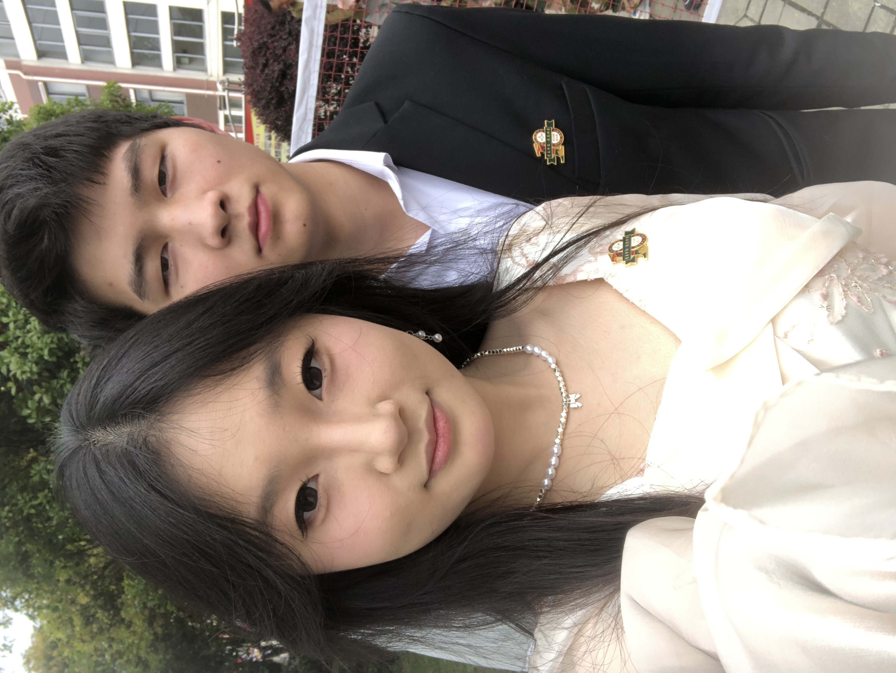
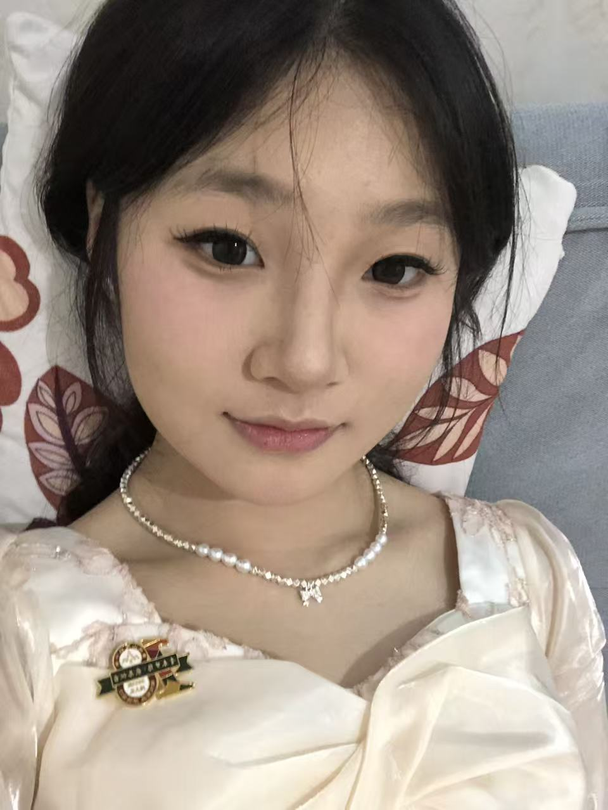
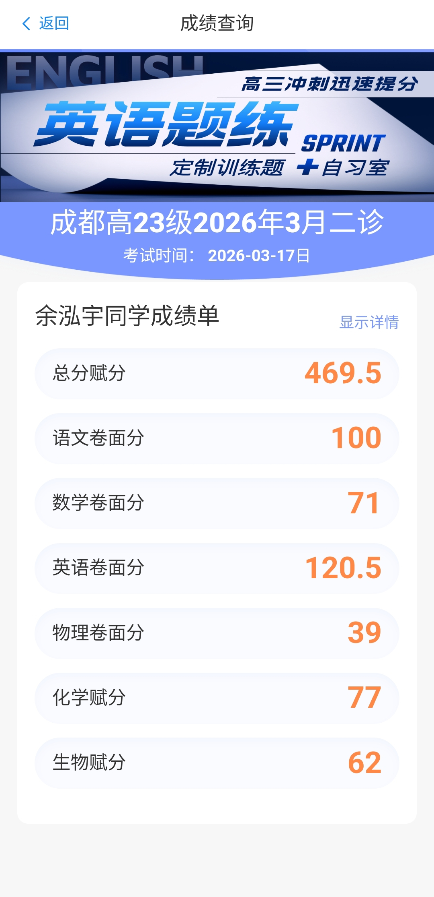
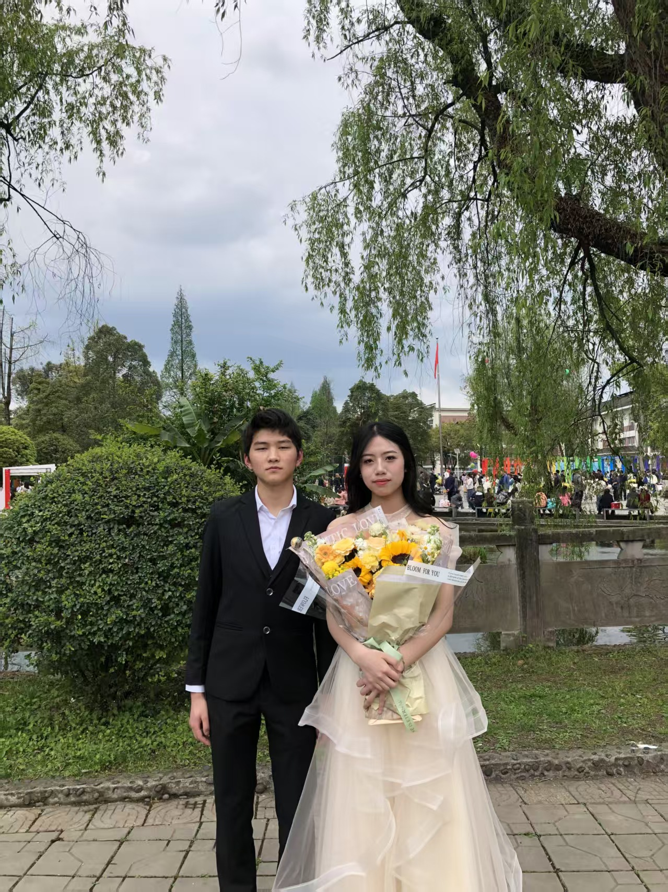
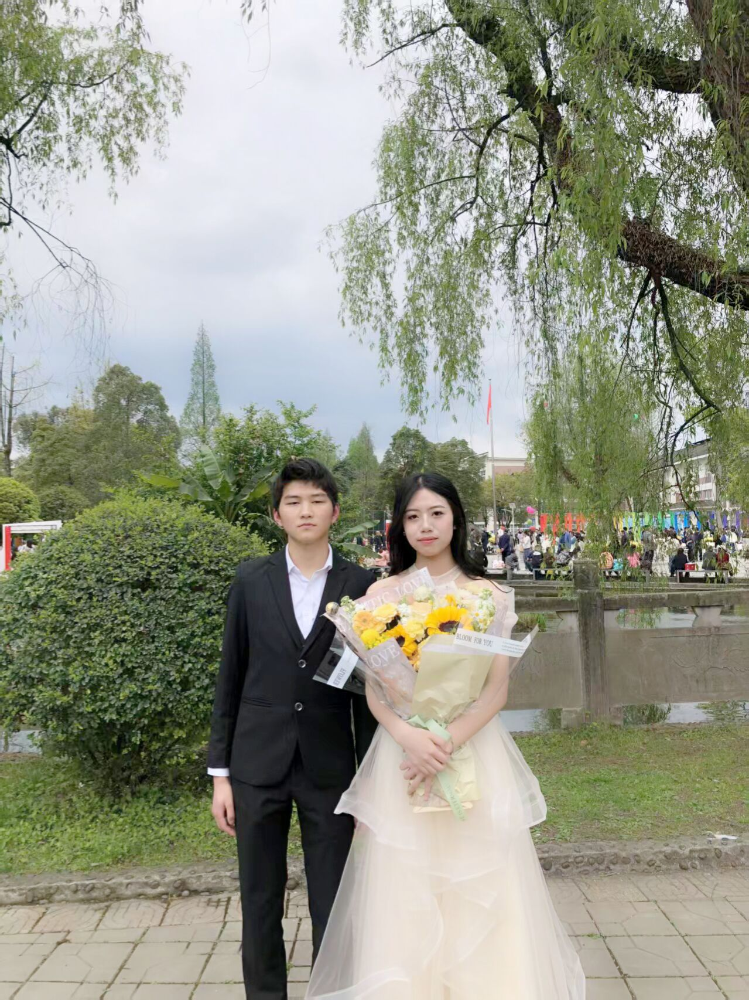
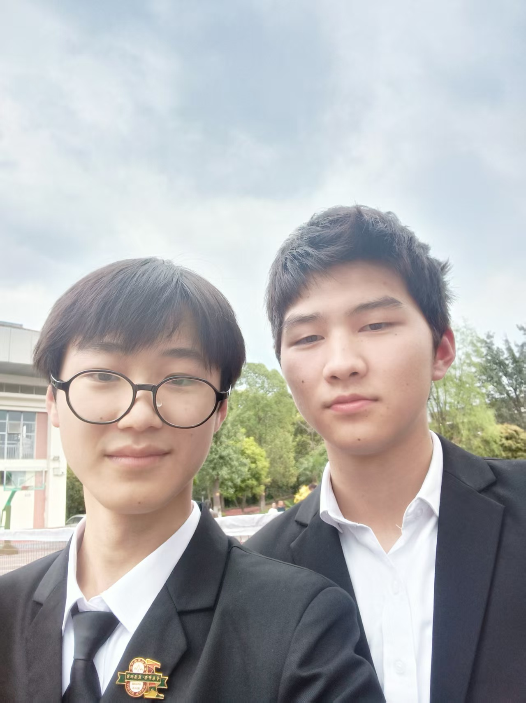

昨天成人礼，刘钰微她表姐给她画了妆，然而脸稍微显得有点白，我想涂个更鲜艳的口红或许会好一点。她本人看着还是很漂亮的，照片上不知怎么显得脸很胖。我觉得有些遗憾。我很喜欢刘钰微，觉得她比起六班校花“赏心”来也不差，只是稍微矮了一点点。“赏心”比较远，她比较近，我对“赏心”除了觉得好看，别的什么也没了，假如我真的认识，或者可能讨厌她也不然？；我的朋友很少，杨国娇是第一个，大概也是最重要的朋友，不过昨天没有她的消息，我真正选错了学校？刘钰微，杨灵薇或许可以说第二个？

成都二诊成绩出来了，王俊宇数学物理双满分，只是微微扣了几分，总分 616。我就用 469.5 结束。本来预估只有 430。吕佳豪英语140.5？反正上了140，好像前面扣了 5.5，后面一共也只扣了4.5。我后面扣了 9 分。我上周把那本腾远英语习题又写完了，之前拿到二轮英语习题册马不停蹄地就把小的那本写完。不停止的头疼。我大概还是有些伤心，我对各方面英语基础，语法可以说烂熟于心，不过做题方面我只是新手而已；我也发现各种试卷、报纸阅读题真是绝佳的阅读材料，我找李老师把剩下好久的英语作业都要过来做了，我靠他们积累单词，觉得趣味无穷，真是停不下来。希望我老了还能抱着一本英语书津津有味地读下去。

昨天还是觉得遗憾，看着一片天空里放飞的气球，杨国娇没有一点消息，她现在还在四中否？过年想要找她补齐一张初中毕业合照。心愿终究没有圆。气球也不够，我恰好也没有带写上梦想的小卡片（绑在气球下面），我写的「All in God's hands.」，表示一切只待上帝安排。

顾紫君脸上的妆实际上看着效果也挺好，拍照并没能拍出来。她叫我帮她抬凳子，然而秩序究竟混乱，刘梦南哭了，似乎她们班不听安排。一会儿要抬一会儿不抬，什么鬼东西！最后说是不用抬了。一开始我抬凳子时候张煜城说留给另一个班，否则坐不了。后面差点以为顾紫君衣服掉了，还好找到了，否则我得赔钱。

前一天我去看照片墙去的太晚被何定武抓了，叫我们中午别睡，回教室拿扫把去扫地，我一去不复返，回教室看康议在讲成人礼安排。出教室上厕所看见其他受罚的人都拿着扫把回去了。

徐奥随手一拍，效果居然也不差。

皮鞋穿着太累，脚疼。顾紫君，刘钰微穿高跟鞋，顾紫君回教室路上直接脱了鞋走，刘钰微脚疼也要出片，我说我也疼，刘钰微一脸不相信。

陈何子谦早就找我坐同桌，后来刘钰微又传纸条过了找我坐同桌，这是我没有料到的，想来有点后悔。不过既然答应了陈何子谦，我想我就不会改变了。